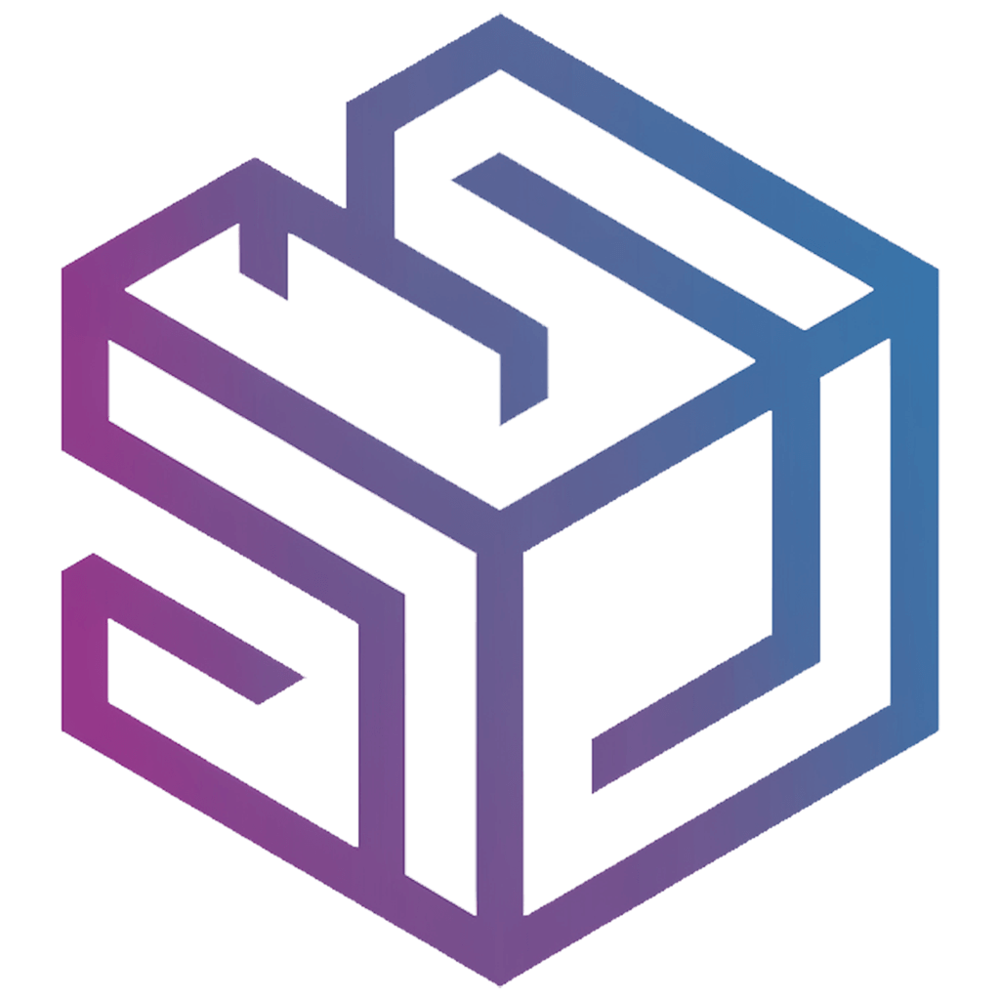
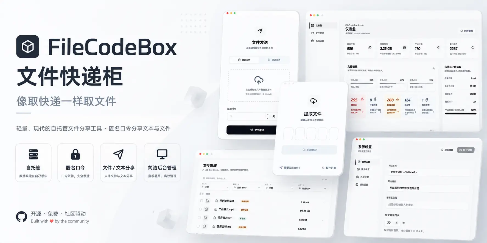
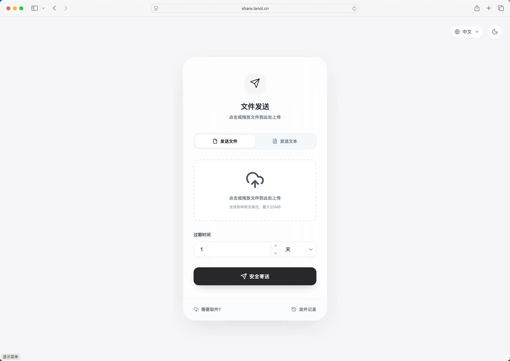
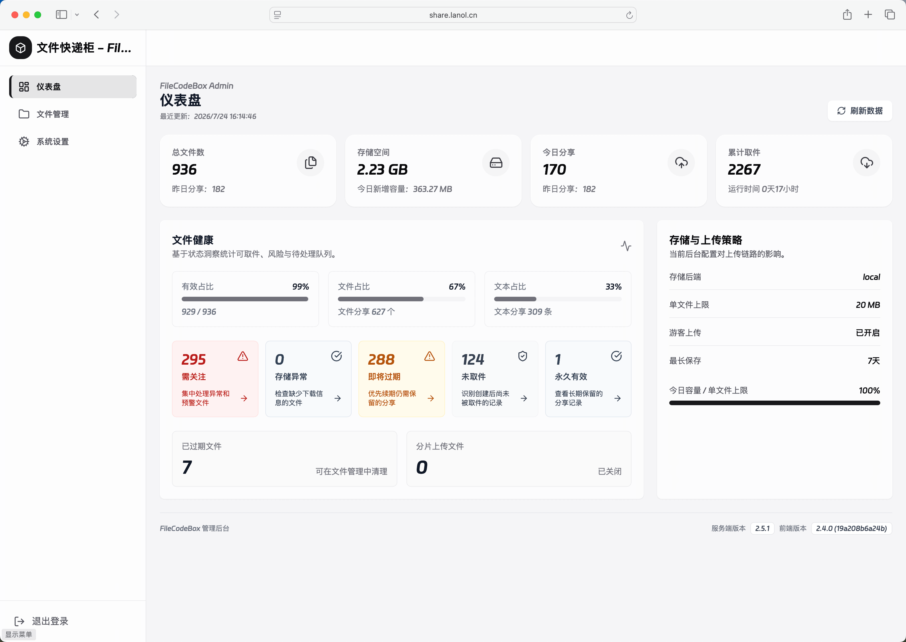
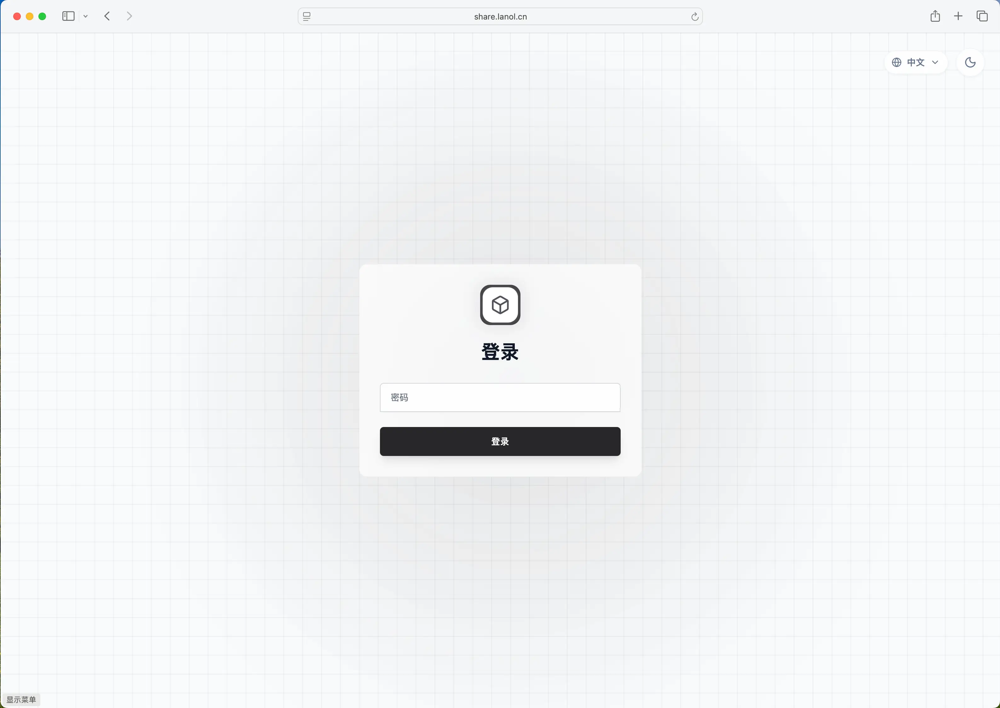
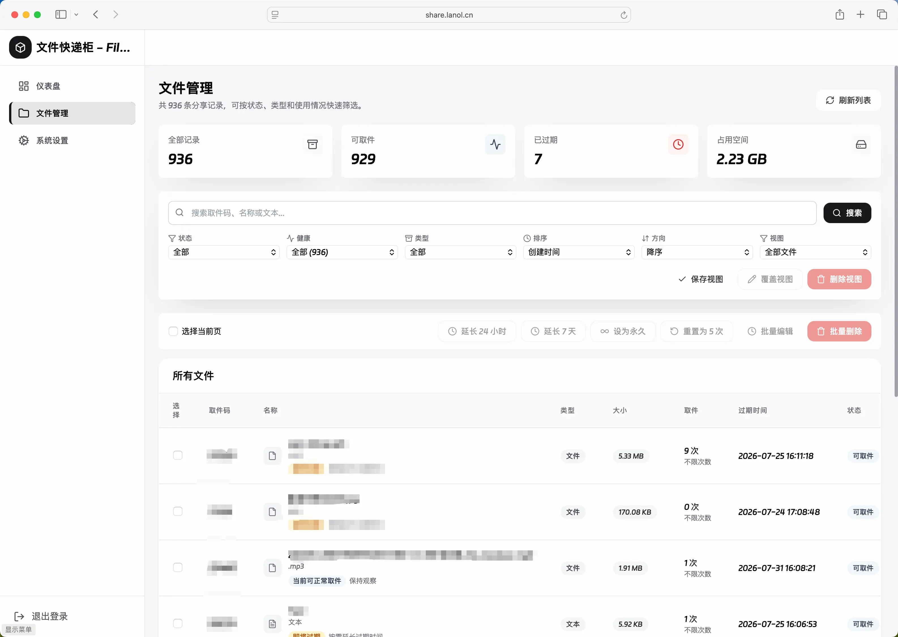
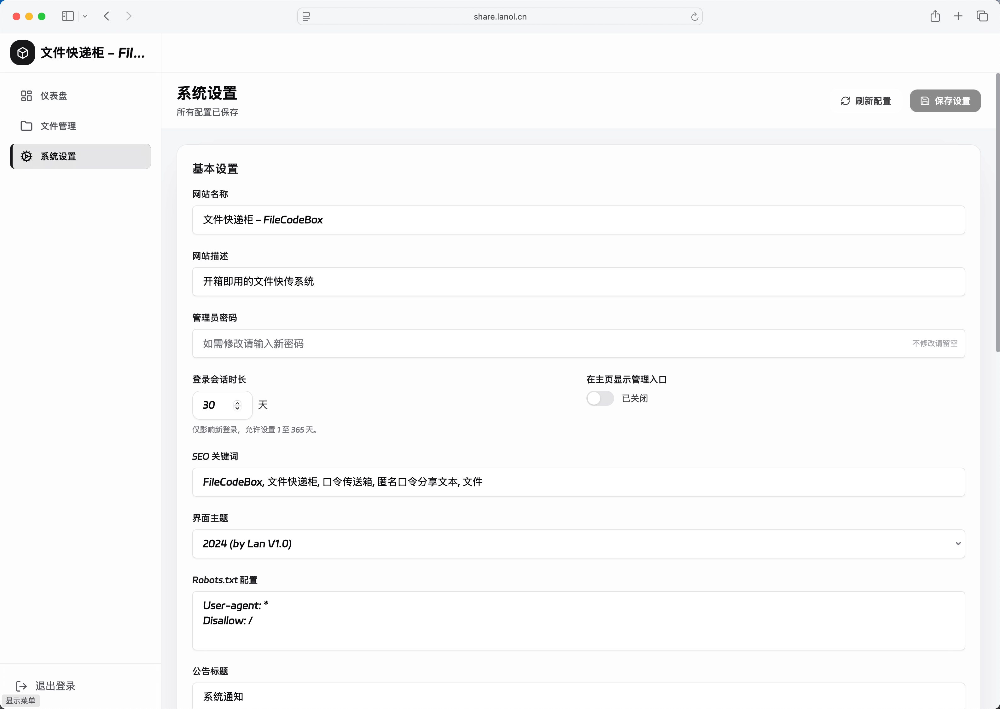

<div align="center">



# FileCodeBox

### 像取快递一样取文件

一个轻量、现代的自托管文件分享工具。无需注册，上传后获得口令，对方输入即可取件。

[在线演示](https://share.lanol.cn)　·　[使用文档](https://fcb-docs.aiuo.net/)　·　[English](./readme_en.md)

[](https://github.com/vastsa/FileCodeBox/releases/latest)
[](https://hub.docker.com/r/lanol/filecodebox)
[](https://github.com/vastsa/FileCodeBox/stargazers)
[](./LICENSE)

<br />



</div>

## 一条命令开始

```bash
docker run -d --restart unless-stopped \
  -p 12345:12345 \
  -v ./data:/app/data \
  -e APP_ENV=production \
  -e LOG_LEVEL=warning \
  --log-opt max-size=10m \
  --log-opt max-file=3 \
  --name filecodebox \
  lanol/filecodebox:2.5.6 # x-release-please-version
```

访问 `http://localhost:12345`，完成首次初始化。生产环境建议固定版本号；`latest` 指向最新正式版。

## 简单，但足够强大

<table>
<tr>
<td width="33%" valign="top"><b>即传即取</b><br /><sub>文件与文本统一分享，支持拖拽、粘贴、批量与分片上传。</sub></td>
<td width="33%" valign="top"><b>按需失效</b><br /><sub>按时间、取件次数或永久保存，自动清理过期内容。</sub></td>
<td width="33%" valign="top"><b>数据自主</b><br /><sub>本地、S3、OneDrive、WebDAV 与 OpenDAL，数据留在自己的基础设施。</sub></td>
</tr>
</table>

## 从分享，到管理

<table>
<tr>
<td width="50%"></td>
<td width="50%"></td>
</tr>
</table>

<table>
<tr>
<td width="33%"></td>
<td width="33%"></td>
<td width="33%"></td>
</tr>
</table>

<div align="center">

`FastAPI`　`Vue 3`　`SQLite`　`Docker`　`S3`　`WebDAV`　`Dark Mode`

</div>

## 继续了解

- [快速开始](https://fcb-docs.aiuo.net/guide/getting-started) · 部署、初始化与升级
- [存储配置](https://fcb-docs.aiuo.net/guide/storage) · 本地与对象存储
- [安全设置](https://fcb-docs.aiuo.net/guide/security) · 限流、会话与访问保护
- [API 文档](https://fcb-docs.aiuo.net/api/) · 上传、取件与管理接口
- [前端源码](https://github.com/vastsa/FileCodeBoxFronted) · 当前 2024 主题

## 相关项目

如果你也喜欢「盒子」系列的自托管工具，可以看看同作者的：

### [BokeBox](https://github.com/vastsa/BokeBox/) · 私人 AI 播客盒

把视频、链接或文稿丢进去，生成可听完的个人播客，支持自定义主持人设与声音。

<p align="center">
  <a href="https://github.com/vastsa/BokeBox/">
    
  </a>
</p>

<p align="center">
  <a href="https://github.com/vastsa/BokeBox/">
    
  </a>
</p>

## 参与项目

欢迎 [提交 Issue](https://github.com/vastsa/FileCodeBox/issues/new/choose) 或 Pull Request。项目基于 [LGPL-3.0](./LICENSE) 发布。

## 免责声明

本项目仅供合法的文件与文本分享场景使用。请勿上传、存储或传播违法、侵权或未经授权的内容；使用者应自行承担部署、数据合规与内容管理责任。

<div align="center">

**如果 FileCodeBox 对你有帮助，欢迎点亮一个 Star。**

</div>


## 🌐 Web Resources & Interactive Index
- [CATEGORY SANDBOX40](https://studyplayings.web.app/category-sandbox40.html)
- [PHOTO BLOCK JOURNEY](https://studyplaying.github.io/photo-block-journey.html)
- [ALIEN INTELLIGENCE TEST](https://learnquester.github.io/alien-intelligence-test.html)
- [BUBBLE UP](https://skillplay.github.io/bubble-up.html)
- [NOOB FUN FISHING](https://quizverses-9d2f2.web.app/noob-fun-fishing.html)
- [MURDER](https://quizverses.github.io/murder.html)
- [DINO SIMULATOR CITY ATTACK](https://studyplayings.web.app/dino-simulator-city-attack.html)
- [WORD VOYAGER](https://thelearnquester.web.app/word-voyager.html)
- [CATEGORY TURN BASED](https://quizverses.github.io/category-turn-based.html)
- [DUNGEONS N DUCKS](https://studyplaying.github.io/dungeons-n-ducks.html)
- [BRAT GIRL SUMMER](https://studyquesthub.web.app/brat-girl-summer.html)
- [NEW YEAR MAKEUP TRENDS](https://studyquests.github.io/new-year-makeup-trends.html)
- [TUNG TUNG SAHUR OBBY CHALLENGE](https://thequizzone.pages.dev/tung-tung-sahur-obby-challenge.html)
- [CAP](https://thequizzone.pages.dev/cap.html)
- [DINO SIMULATOR CITY ATTACK](https://thequizzone.pages.dev/dino-simulator-city-attack.html)
- [CATEGORY MAHJONG CONNECT](https://thequizzone.pages.dev/category-mahjong-connect.html)
- [CATEGORY SHOOTER](https://studyplaying.github.io/category-shooter.html)
- [YUMMY TALES 3](https://themindplaying.web.app/yummy-tales-3.html)
- [INDEX8](https://iskillquest.pages.dev/index8.html)
- [CATEGORY CARDS](https://themindzone.pages.dev/category-cards.html)
- [DARING JACK](https://studyplaying.github.io/daring-jack.html)
- [TICTOC BRAIDED HAIRSTYLES](https://learnquesters.pages.dev/tictoc-braided-hairstyles.html)
- [TOY RUMBLE 3D](https://theskillquest.pages.dev/toy-rumble-3d.html)
- [MERGE GALAXY](https://learnquester.github.io/merge-galaxy.html)
- [CATEGORY 2D1 070](https://studyquesthub.web.app/category-2d1-070.html)
- [ZOMBIE MONSTER SURVIVORS](https://studyplaying.github.io/zombie-monster-survivors.html)
- [MADNESS DRIVER VERTIGO CITY](https://quizverses.github.io/madness-driver-vertigo-city.html)
- [ELEMENTAL DRESSUP MAGIC](https://learnquester.github.io/elemental-dressup-magic.html)
- [GEOMETRY VERTICAL](https://thequizzone.pages.dev/geometry-vertical.html)
- [BRICK BLAZE](https://studyquests.github.io/brick-blaze.html)
- [ARCHERS RANDOM](https://studyplaying.github.io/archers-random.html)
- [BMG CRASHDAY 2025](https://learnquester.github.io/bmg-crashday-2025.html)
- [DOGGO JUMP](https://studyquests.github.io/doggo-jump.html)
- [MATCH FIND 3D](https://studyquests.github.io/match-find-3d.html)
- [TILEMAN IO](https://theskillquest.pages.dev/tileman-io.html)
- [REMOVE THE BLOCKS](https://theskillquest.pages.dev/remove-the-blocks.html)
- [SOLAR SMASH](https://studyplaying.github.io/solar-smash.html)
- [CATEGORY IO](https://themindzone.pages.dev/category-io.html)
- [HYPER SURVIVE](https://studyquests.github.io/hyper-survive.html)
- [CATEGORY BOXING12](https://themindzone.pages.dev/category-boxing12.html)
- [CITY BUILDER](https://thequizzone.pages.dev/city-builder.html)
- [SUPERHERO TRANSFORM CHANGE RACE](https://studyquests.github.io/superhero-transform-change-race.html)
- [WAR OF GUN](https://studyplaying.github.io/war-of-gun.html)
- [OCEAN KIDS BACK TO SCHOOL](https://theskillquest.pages.dev/ocean-kids-back-to-school.html)
- [KOMPOTS KITCHEN](https://theskillquest.pages.dev/kompots-kitchen.html)
- [COIN EMPIRE](https://theskillquest.pages.dev/coin-empire.html)
- [SAVE THE CROP](https://studyplaying.github.io/save-the-crop.html)
- [WEAPONS AND RAGDOLLS](https://theskillquest.pages.dev/weapons-and-ragdolls.html)
- [CATEGORY FPS 2](https://studyquests.github.io/category-fps-2.html)
- [COUNTER CRAFT SNIPER](https://theskillquest.pages.dev/counter-craft-sniper.html)
- [COLOR CONQUEST TERRITORY WAR](https://studyquests.github.io/color-conquest-territory-war.html)
- [LIMITED DEFENSE](https://theskillquest.pages.dev/limited-defense.html)
- [CODE MAZE](https://learnquesters.pages.dev/code-maze.html)
- [LIGHT LINE](https://quizverses.github.io/light-line.html)
- [CATEGORY DEFENSE176](https://quizverses.github.io/category-defense176.html)
- [COP RUN 3D](https://theskillquest.pages.dev/cop-run-3d.html)
- [SISYPHUS SIMULATOR](https://studyquests.github.io/sisyphus-simulator.html)
- [CUT THE GRASS 3D](https://quizverses.github.io/cut-the-grass-3d.html)
- [CHICKEN STRIKE](https://theskillquest.pages.dev/chicken-strike.html)
- [CATEGORY OBBY56](https://thelearnquester.web.app/category-obby56.html)
- [MAGIC FINGER PUZZLE 3D](https://learnquesters.pages.dev/magic-finger-puzzle-3d.html)
- [LEGEND OF FIREBALL](https://thequizzone.pages.dev/legend-of-fireball.html)
- [CATEGORY MATCH 3 2](https://thequizzone.pages.dev/category-match-3-2.html)
- [MY HAPPY FARM](https://thequizzone.pages.dev/my-happy-farm.html)
- [DISK RUSH](https://studyplayings.web.app/disk-rush.html)
- [ALIEN INTELLIGENCE TEST](https://studyquests.github.io/alien-intelligence-test.html)
- [SWIM GOOD](https://theskillquest.pages.dev/swim-good.html)
- [BEGGAR CLICKER](https://theskillquest.pages.dev/beggar-clicker.html)
- [CATEGORY RELAXING223](https://thequizzone.pages.dev/category-relaxing223.html)
- [MAGIC BUBBLES](https://theskillquest.pages.dev/magic-bubbles.html)
- [TAP BLOCK PUZZLE SMASH GAME](https://theskillquest.pages.dev/tap-block-puzzle-smash-game.html)
- [BACKYARD DIG HOLE 3D SIMULATOR](https://studyplayings.web.app/backyard-dig-hole-3d-simulator.html)
- [CIRCLE RUN ENDLESS](https://thequizzone.pages.dev/circle-run-endless.html)
- [RUNNING LATE](https://quizverses.github.io/running-late.html)
- [RENT OUT LANDLORD TYCOON](https://thequizzone.pages.dev/rent-out-landlord-tycoon.html)
- [MOJICON FRUIT CONNECT](https://thequizzone.pages.dev/mojicon-fruit-connect.html)
- [POXEL IO](https://studyquests.github.io/poxel-io.html)
- [FAR ORION NEW WORLDS](https://thequizzone.pages.dev/far-orion-new-worlds.html)
- [FREDDYS NIGHTMARES RETURN HORROR NEW YEAR](https://studyquests.github.io/freddys-nightmares-return-horror-new-year.html)
- [SUMMER MAZE](https://quizverses.github.io/summer-maze.html)
- [GEOMETRY VIBES X ARROW](https://studyplayings.web.app/geometry-vibes-x-arrow.html)
- [CATEGORY PARKOUR55](https://thequizzone.pages.dev/category-parkour55.html)
- [WORDLING DAILY WORD CHALLENGE](https://theskillquest.pages.dev/wordling-daily-word-challenge.html)
- [NEW YEAR S EVE MAKEUP](https://thequizzone.pages.dev/new-year-s-eve-makeup.html)
- [ROBBY BOMBERMAN](https://thequizzone.pages.dev/robby-bomberman.html)
- [ROBLOX CRAFT RUN](https://theskillquest.pages.dev/roblox-craft-run.html)
- [DR PARKING](https://theskillquest.pages.dev/dr-parking.html)
- [CATEGORY PUZZLE 4](https://thelearnquester.web.app/category-puzzle-4.html)
- [CATEGORY FPS 2](https://quizverses.github.io/category-fps-2.html)
- [WORLD FLAGS TRIVIA](https://thequizzone.pages.dev/world-flags-trivia.html)
- [LUCY ALL SEASON FASHIONINSTA](https://thequizzone.pages.dev/lucy-all-season-fashioninsta.html)
- [CATEGORY CARTOON76](https://themindzone.pages.dev/category-cartoon76.html)
- [TILE PAIR MATCH](https://theskillquest.pages.dev/tile-pair-match.html)
- [CATEGORY PREMIUM PERKS71](https://thequizzone.pages.dev/category-premium-perks71.html)
- [CATEGORY SANDBOX41](https://thequizzone.pages.dev/category-sandbox41.html)
- [BULLET SUPERHERO](https://studyplayings.web.app/bullet-superhero.html)
- [SHOP SORTING XMAS](https://theskillquest.pages.dev/shop-sorting-xmas.html)
- [BUBBLE FEVER BLAST](https://thequizzone.pages.dev/bubble-fever-blast.html)
- [CATEGORY CASUAL 10](https://themindzone.pages.dev/category-casual-10.html)
- [CATEGORY ADVENTURE 2](https://themindzone.pages.dev/category-adventure-2.html)
- [MERGE PIXEL](https://theskillquest.pages.dev/merge-pixel.html)
- [STICK MASTER TELEPORT](https://thequizzone.pages.dev/stick-master-teleport.html)
- [MYSTIC OBJECT HUNT](https://themindplay.github.io/mystic-object-hunt.html)
- [CATEGORY PUZZLE 9](https://themindplays.pages.dev/category-puzzle-9.html)
- [ADDICTION MINI SOLITAIRE](https://quizverses.github.io/addiction-mini-solitaire.html)
- [TRAVEL WITH ME ASMR EDITION](https://theskillquest.pages.dev/travel-with-me-asmr-edition.html)
- [TURBO RACE 3D](https://learnquester.github.io/turbo-race-3d.html)
- [CATEGORY ZOMBIE175](https://thequizzone.pages.dev/category-zombie175.html)
- [TOYTOPIA](https://studyplaying.github.io/toytopia.html)
- [MY PET CARE SALON](https://themindplaying.web.app/my-pet-care-salon.html)
- [FIGHT TRIVIA](https://themindplay.pages.dev/fight-trivia.html)
- [INDEX31](https://thelearnquesters.pages.dev/index31.html)
- [CATEGORY CASUAL 8](https://learnquester.github.io/category-casual-8.html)
- [STACK SORTING](https://themindplays.pages.dev/stack-sorting.html)
- [DESIGN WITH ME SUPERHERO TUTU OUTFITS](https://theskillquest.pages.dev/design-with-me-superhero-tutu-outfits.html)
- [BACKROOMS SKIBIDI TERRORS](https://theskillquest.pages.dev/backrooms-skibidi-terrors.html)
- [LIGHT ACADEMIA FASHION](https://theskillquest.pages.dev/light-academia-fashion.html)
- [TEXAS HOLDEM POKER](https://theskillquest.pages.dev/texas-holdem-poker.html)
- [STEAL BRAINROT ARENA](https://iskillquest.pages.dev/steal-brainrot-arena.html)
- [OREPLICATION](https://themindplays.pages.dev/oreplication.html)
- [VARIETY MECHA](https://themindplay.github.io/variety-mecha.html)
- [WAR ROBOTS BATTLES](https://theskillquest.pages.dev/war-robots-battles.html)
- [BUILD A RICH QUEEN](https://theskillquest.pages.dev/build-a-rich-queen.html)
- [CRAFT DRILL](https://studyquests.github.io/craft-drill.html)
- [TRIPLE CUPS](https://learnquesters.pages.dev/triple-cups.html)
- [HILL STATION BUS SIMULATOR](https://studyquests.github.io/hill-station-bus-simulator.html)
- [MEGA JUMP](https://quizverses.github.io/mega-jump.html)
- [PUZZLE BLOCKS](https://thequizzone.pages.dev/puzzle-blocks.html)
- [BLACK PINK STPATRICKS DAY CONCERT](https://studyplayings.web.app/black-pink-stpatricks-day-concert.html)
- [FIGHT TO THE END](https://studyquests.github.io/fight-to-the-end.html)
