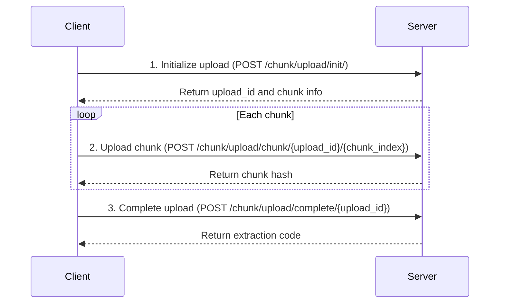

# File Sharing

FileCodeBox provides simple and easy-to-use file and text sharing functionality. Users can securely share and retrieve files using extraction codes.

## Sharing Methods

FileCodeBox supports two sharing methods:

1. **Text Sharing** - Share text content directly, suitable for code snippets, configuration files, etc.
2. **File Sharing** - Upload files for sharing, supports various file formats

## Text Sharing

### How to Use

1. Select the "Text Share" tab on the homepage
2. Enter or paste the content to share in the text box
3. Select expiration method and time
4. Click the "Share" button
5. Get the extraction code

### Text Size Limit

::: warning Note
The maximum content size for text sharing is **222KB** (227,328 bytes). If content exceeds this limit, it's recommended to use file sharing instead.
:::

Text content size is calculated using UTF-8 encoding. Chinese characters typically occupy 3 bytes.

### API Endpoint

**POST** `/share/text/`

Request parameters:

| Parameter | Type | Required | Description |
|-----------|------|----------|-------------|
| `text` | string | Yes | Text content to share |
| `expire_value` | int | No | Expiration value, default 1 |
| `expire_style` | string | No | Expiration method, default `day` |

Response example:

```json
{
  "code": 200,
  "detail": {
    "code": "123456"
  }
}
```

## File Sharing

### How to Use

1. Select the "File Share" tab on the homepage
2. Click the upload area or drag files to the upload area
3. Select expiration method and time
4. Click the "Upload" button
5. Get the extraction code

### File Size Limit

The default maximum single file upload size is **10MB**. Administrators can modify this limit via the `uploadSize` configuration.

::: tip Tip
If you need to upload large files, contact the administrator to enable chunked upload functionality or adjust the `uploadSize` configuration.
:::

### Supported Upload Methods

- **Click Upload** - Click the upload area to select files
- **Drag Upload** - Drag files to the upload area
- **Paste Upload** - Paste images from clipboard (supported by some themes)

### API Endpoint

**POST** `/share/file/`

Request parameters (multipart/form-data):

| Parameter | Type | Required | Description |
|-----------|------|----------|-------------|
| `file` | file | Yes | File to upload |
| `expire_value` | int | No | Expiration value, default 1 |
| `expire_style` | string | No | Expiration method, default `day` |

Response example:

```json
{
  "code": 200,
  "detail": {
    "code": "654321",
    "name": "example.pdf"
  }
}
```


## Expiration Settings

FileCodeBox supports multiple flexible expiration methods:

| Expiration Method | Parameter Value | Description |
|-------------------|-----------------|-------------|
| By Days | `day` | File expires after specified days |
| By Hours | `hour` | File expires after specified hours |
| By Minutes | `minute` | File expires after specified minutes |
| Never Expire | `forever` | File is permanently valid |
| By Count | `count` | File expires after specified download count |

::: info Note
- Administrators can control available expiration methods via the `expireStyle` configuration
- Administrators can limit maximum file retention time via the `max_save_seconds` configuration
:::

### Expiration Method Examples

```bash
# File expires after 3 days
expire_value=3, expire_style=day

# File expires after 12 hours
expire_value=12, expire_style=hour

# File expires after 30 minutes
expire_value=30, expire_style=minute

# File never expires
expire_value=1, expire_style=forever

# File expires after 5 downloads
expire_value=5, expire_style=count
```

## Retrieving Files

### How to Use

1. Enter the extraction code in the "Retrieve File" area on the homepage
2. Click the "Retrieve" button
3. System displays file information (filename, size, etc.)
4. Click the "Download" button to download the file, or view text content directly

### Extraction Code Notes

- Extraction codes are typically **6-digit numbers**
- Files that never expire use **alphanumeric** extraction codes
- Extraction codes are case-sensitive (for alphanumeric codes)

### API Endpoints

**Query File Information**

**POST** `/share/select/`

Request parameters:

```json
{
  "code": "123456"
}
```

Response example (file):

```json
{
  "code": 200,
  "detail": {
    "code": "123456",
    "name": "example.pdf",
    "size": 1048576,
    "text": "https://example.com/download/..."
  }
}
```

Response example (text):

```json
{
  "code": 200,
  "detail": {
    "code": "123456",
    "name": "Text",
    "size": 1024,
    "text": "This is the shared text content..."
  }
}
```

**Direct File Download**

**GET** `/share/select/?code=123456`

This endpoint returns file content directly, suitable for direct browser access.

## Chunked Upload (Large Files)

For large file uploads, FileCodeBox supports chunked upload functionality. This feature requires administrator enablement (`enableChunk=1`).

### Chunked Upload Flow



### 1. Initialize Upload

**POST** `/chunk/upload/init/`

Request parameters:

```json
{
  "file_name": "large_file.zip",
  "file_size": 104857600,
  "chunk_size": 5242880,
  "file_hash": "sha256_hash_of_file"
}
```

| Parameter | Type | Required | Description |
|-----------|------|----------|-------------|
| `file_name` | string | Yes | Filename |
| `file_size` | int | Yes | Total file size (bytes) |
| `chunk_size` | int | No | Chunk size, default 5MB |
| `file_hash` | string | Yes | SHA256 hash of the file |

Response example:

```json
{
  "code": 200,
  "detail": {
    "existed": false,
    "upload_id": "abc123def456",
    "chunk_size": 5242880,
    "total_chunks": 20,
    "uploaded_chunks": []
  }
}
```

### 2. Upload Chunk

**POST** `/chunk/upload/chunk/{upload_id}/{chunk_index}`

- `upload_id` - Upload session ID returned during initialization
- `chunk_index` - Chunk index, starting from 0

Request body: Chunk file data (multipart/form-data)

Response example:

```json
{
  "code": 200,
  "detail": {
    "chunk_hash": "sha256_hash_of_chunk"
  }
}
```

### 3. Complete Upload

**POST** `/chunk/upload/complete/{upload_id}`

Request parameters:

```json
{
  "expire_value": 1,
  "expire_style": "day"
}
```

Response example:

```json
{
  "code": 200,
  "detail": {
    "code": "789012",
    "name": "large_file.zip"
  }
}
```

### Resume Upload

Chunked upload supports resume functionality. If upload is interrupted:

1. Call the initialization endpoint again with the same `file_hash`
2. Server returns `uploaded_chunks` list containing already uploaded chunk indices
3. Client only needs to upload chunks not in the list

## Error Handling

### Common Error Codes

| Error Code | Description | Solution |
|------------|-------------|----------|
| 403 | File size exceeds limit | Reduce file size or contact administrator to adjust limit |
| 403 | Content too large | Text exceeds 222KB, use file sharing instead |
| 403 | Upload rate limit | Wait a while before retrying |
| 404 | File not found | Check if extraction code is correct |
| 404 | File expired | File has expired or download count exhausted |

### Rate Limiting

To prevent abuse, the system has rate limits on upload and retrieval operations:

- **Upload limit**: Default max 10 uploads per minute
- **Error limit**: Default max 1 error attempt per minute

::: tip Tip
If you encounter rate limiting, wait for the limit time window to pass before retrying.
:::

## Next Steps

- [Configuration Guide](/en/guide/configuration) - Learn how to configure sharing-related settings
- [Storage Configuration](/en/guide/storage) - Learn about file storage methods
- [Security Settings](/en/guide/security) - Learn about security-related configurations
- [Admin Panel](/en/guide/management) - Learn how to manage shared files
