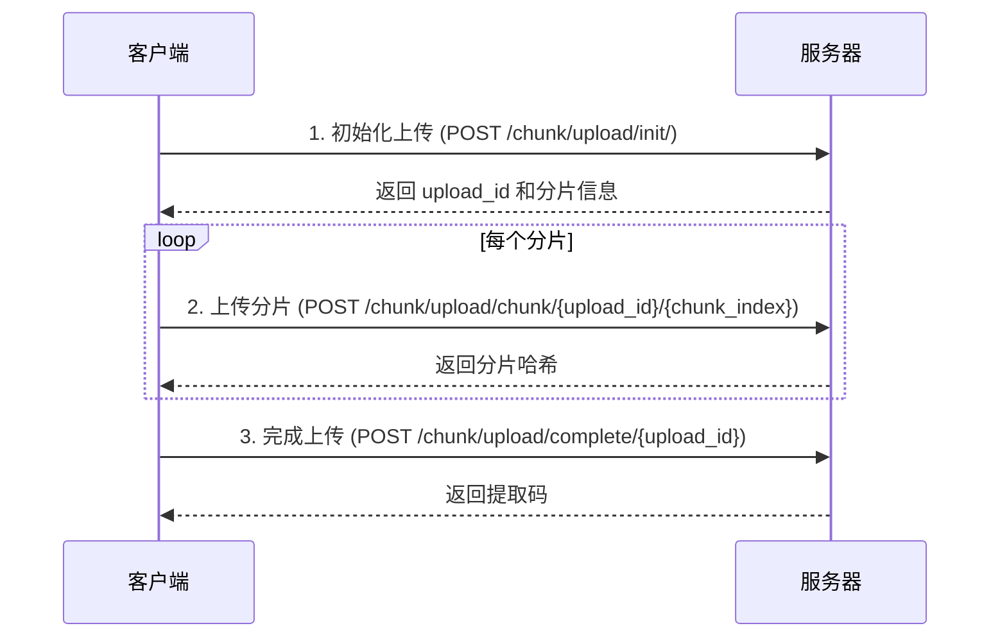

# 文件分享

FileCodeBox 提供了简单易用的文件和文本分享功能。用户可以通过提取码安全地分享和获取文件。

## 分享方式

FileCodeBox 支持两种分享方式：

1. **文本分享** - 直接分享文本内容，适合代码片段、配置文件等
2. **文件分享** - 上传文件进行分享，支持各种文件格式

## 文本分享

### 使用方法

1. 在首页选择「文本分享」标签
2. 在文本框中输入或粘贴要分享的内容
3. 选择过期方式和时间
4. 点击「分享」按钮
5. 获取提取码

### 文本大小限制

::: warning 注意
文本分享的最大内容大小为 **222KB**（227,328 字节）。如果内容超过此限制，建议使用文件分享方式。
:::

文本内容大小按 UTF-8 编码计算，中文字符通常占用 3 个字节。

### API 接口

**POST** `/share/text/`

请求参数：

| 参数 | 类型 | 必填 | 说明 |
|------|------|------|------|
| `text` | string | 是 | 要分享的文本内容 |
| `expire_value` | int | 否 | 过期数值，默认 1 |
| `expire_style` | string | 否 | 过期方式，默认 `day` |

响应示例：

```json
{
  "code": 200,
  "detail": {
    "code": "123456"
  }
}
```

## 文件分享

### 使用方法

1. 在首页选择「文件分享」标签
2. 点击上传区域或拖拽文件到上传区域
3. 选择过期方式和时间
4. 点击「上传」按钮
5. 获取提取码

### 文件大小限制

默认单文件最大上传大小为 **10MB**。管理员可以通过 `uploadSize` 配置项修改此限制。

::: tip 提示
如果需要上传大文件，请联系管理员启用分片上传功能，或调整 `uploadSize` 配置。
:::

### 支持的上传方式

- **点击上传** - 点击上传区域选择文件
- **拖拽上传** - 将文件拖拽到上传区域
- **粘贴上传** - 从剪贴板粘贴图片（部分主题支持）

### API 接口

**POST** `/share/file/`

请求参数（multipart/form-data）：

| 参数 | 类型 | 必填 | 说明 |
|------|------|------|------|
| `file` | file | 是 | 要上传的文件 |
| `expire_value` | int | 否 | 过期数值，默认 1 |
| `expire_style` | string | 否 | 过期方式，默认 `day` |

响应示例：

```json
{
  "code": 200,
  "detail": {
    "code": "654321",
    "name": "example.pdf"
  }
}
```

## 过期设置

FileCodeBox 支持多种灵活的过期方式：

| 过期方式 | 参数值 | 说明 |
|----------|--------|------|
| 按天过期 | `day` | 文件在指定天数后过期 |
| 按小时过期 | `hour` | 文件在指定小时后过期 |
| 按分钟过期 | `minute` | 文件在指定分钟后过期 |
| 永不过期 | `forever` | 文件永久有效 |
| 按次数过期 | `count` | 文件在被下载指定次数后过期 |

::: info 说明
- 管理员可以通过 `expireStyle` 配置项控制用户可选的过期方式
- 管理员可以通过 `max_save_seconds` 配置项限制文件的最长保存时间
:::

### 过期方式示例

```bash
# 文件 3 天后过期
expire_value=3, expire_style=day

# 文件 12 小时后过期
expire_value=12, expire_style=hour

# 文件 30 分钟后过期
expire_value=30, expire_style=minute

# 文件永不过期
expire_value=1, expire_style=forever

# 文件被下载 5 次后过期
expire_value=5, expire_style=count
```

## 提取文件

### 使用方法

1. 在首页的「提取文件」区域输入提取码
2. 点击「提取」按钮
3. 系统会显示文件信息（文件名、大小等）
4. 点击「下载」按钮下载文件，或直接查看文本内容

### 提取码说明

- 提取码通常为 **6 位数字**
- 永不过期的文件使用 **字母数字混合** 的提取码
- 提取码区分大小写（针对字母数字混合的情况）

### API 接口

**查询文件信息**

**POST** `/share/select/`

请求参数：

```json
{
  "code": "123456"
}
```

响应示例（文件）：

```json
{
  "code": 200,
  "detail": {
    "code": "123456",
    "name": "example.pdf",
    "size": 1048576,
    "text": "https://example.com/download/..."
  }
}
```

响应示例（文本）：

```json
{
  "code": 200,
  "detail": {
    "code": "123456",
    "name": "Text",
    "size": 1024,
    "text": "这是分享的文本内容..."
  }
}
```

**直接下载文件**

**GET** `/share/select/?code=123456`

此接口会直接返回文件内容，适合在浏览器中直接访问。

## 分片上传（大文件）

对于大文件上传，FileCodeBox 支持分片上传功能。此功能需要管理员启用（`enableChunk=1`）。

### 分片上传流程



### 1. 初始化上传

**POST** `/chunk/upload/init/`

请求参数：

```json
{
  "file_name": "large_file.zip",
  "file_size": 104857600,
  "chunk_size": 5242880,
  "file_hash": "sha256_hash_of_file"
}
```

| 参数 | 类型 | 必填 | 说明 |
|------|------|------|------|
| `file_name` | string | 是 | 文件名 |
| `file_size` | int | 是 | 文件总大小（字节） |
| `chunk_size` | int | 否 | 分片大小，默认 5MB |
| `file_hash` | string | 是 | 文件的 SHA256 哈希值 |

响应示例：

```json
{
  "code": 200,
  "detail": {
    "existed": false,
    "upload_id": "abc123def456",
    "chunk_size": 5242880,
    "total_chunks": 20,
    "uploaded_chunks": []
  }
}
```

### 2. 上传分片

**POST** `/chunk/upload/chunk/{upload_id}/{chunk_index}`

- `upload_id` - 初始化时返回的上传会话 ID
- `chunk_index` - 分片索引，从 0 开始

请求体：分片文件数据（multipart/form-data）

响应示例：

```json
{
  "code": 200,
  "detail": {
    "chunk_hash": "sha256_hash_of_chunk"
  }
}
```

### 3. 完成上传

**POST** `/chunk/upload/complete/{upload_id}`

请求参数：

```json
{
  "expire_value": 1,
  "expire_style": "day"
}
```

响应示例：

```json
{
  "code": 200,
  "detail": {
    "code": "789012",
    "name": "large_file.zip"
  }
}
```

### 断点续传

分片上传支持断点续传。如果上传中断，可以：

1. 重新调用初始化接口，使用相同的 `file_hash`
2. 服务器会返回已上传的分片列表 `uploaded_chunks`
3. 客户端只需上传未完成的分片

## 错误处理

### 常见错误码

| 错误码 | 说明 | 解决方案 |
|--------|------|----------|
| 403 | 文件大小超过限制 | 减小文件大小或联系管理员调整限制 |
| 403 | 内容过多 | 文本超过 222KB，请使用文件分享 |
| 403 | 上传频率限制 | 等待一段时间后重试 |
| 404 | 文件不存在 | 检查提取码是否正确 |
| 404 | 文件已过期 | 文件已过期或下载次数已用完 |

### 频率限制

为防止滥用，系统对上传和提取操作有频率限制：

- **上传限制**：默认每分钟最多 10 次上传
- **错误限制**：默认每分钟最多 1 次错误尝试

::: tip 提示
如果遇到频率限制，请等待限制时间窗口过后再重试。
:::

## 下一步

- [配置说明](/guide/configuration) - 了解如何配置分享相关设置
- [存储配置](/guide/storage) - 了解文件存储方式
- [安全设置](/guide/security) - 了解安全相关配置
- [管理面板](/guide/management) - 了解如何管理分享的文件
