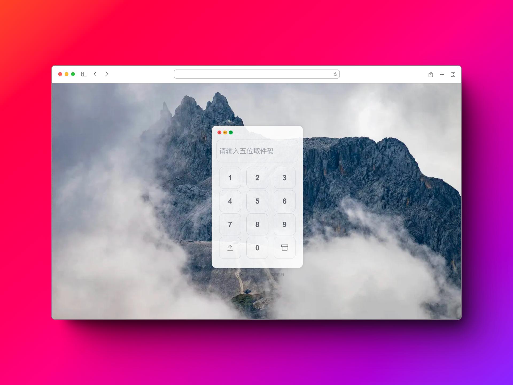
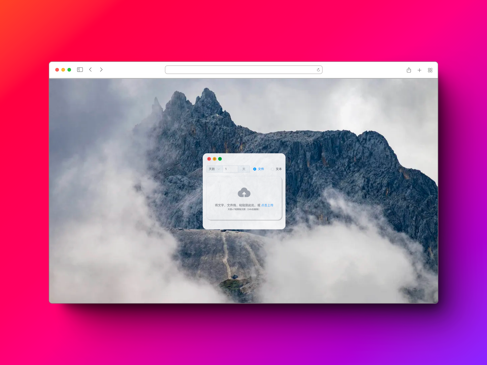
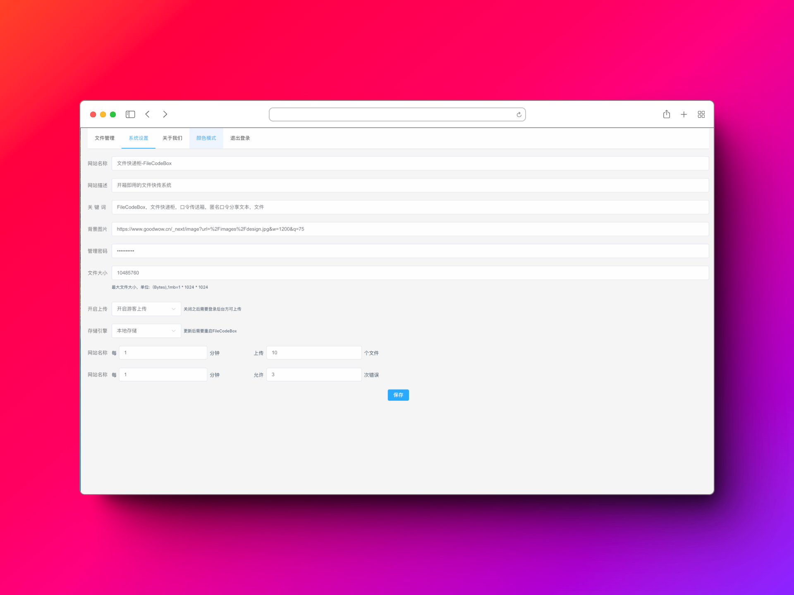
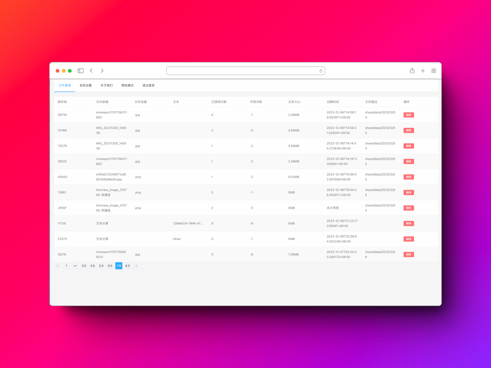
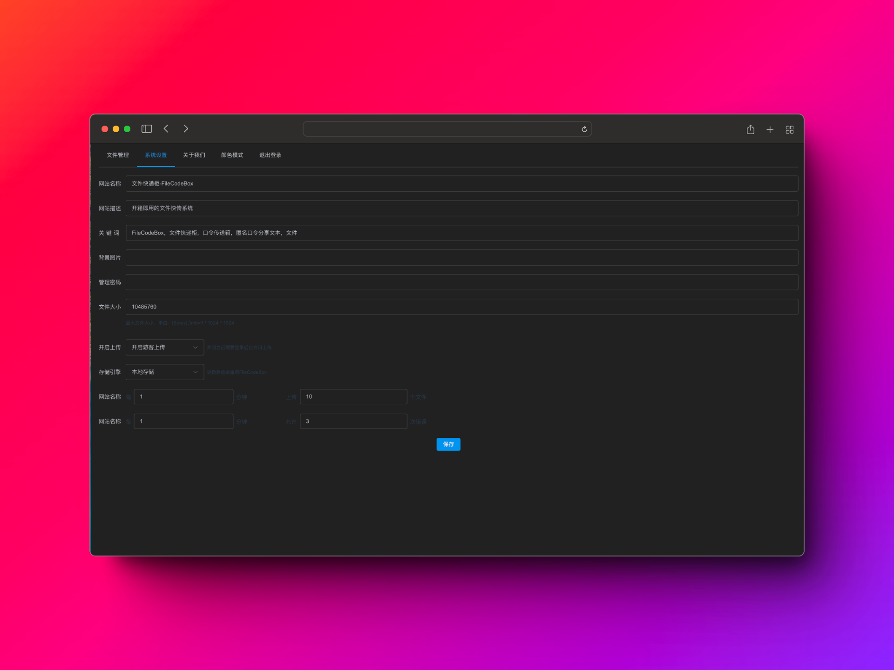

<h1>文件快递柜-轻量</h1>

<em>匿名口令分享文本，文件，像拿快递一样取文件</em>

交流Q群：739673698

---

    <a href="./readme.md">简体中文</a> | 
    <a href="./readme_en.md">English</a> | 
    <a href="https://github.com/vastsa/FileCodeBox/wiki/%E9%83%A8%E7%BD%B2%E6%95%99%E7%A8%8B">部署教程</a> | 
    <a href="https://github.com/vastsa/FileCodeBox/wiki/%E9%83%A8%E7%BD%B2%E6%95%99%E7%A8%8B">常见问题</a>

## 部分截图

<table style="width:100%">
<tr style="width: 100%">
<td style="width: 50%"></td>
<td style="width: 50%"></td>
</tr>
<tr style="width: 100%">
<td style="width: 50%"></td>
<td style="width: 50%"></td>
</tr>
<tr style="width: 100%">
<td style="width: 50%"></td>
<td style="width: 50%"></td>
</tr>
</table>

## 主要特色

- [x] **轻量简洁：** 项目基于Fastapi + Sqlite3 + Vue3 + ElementUI
- [x] **轻松上传：** 支持复制粘贴和拖拽选择
- [x] **多种类型：** 支持文本和文件
- [x] **防止爆破：** 错误次数限制
- [x] **防止滥用：** IP限制上传次数
- [x] **口令分享：** 随机口令，存取文件，自定义次数及有效期
- [x] **国际化：** 支持中文简体、繁体以及英文等
- [x] **匿名分享：** 无需注册，无需登录
- [x] **管理面板：** 查看和删除文件
- [x] **一键部署：** 支持Docker一键部署
- [x] **自由拓展：** 支持S3协议和本地文件流，可根据需求在storage文件中新增存储引擎
- [x] **简单明了：** 适合新手练手项目
- [x] **终端下载：** 终端命令`wget https://share.lanol.cn/share/select?code=83432`

## Badges

## 状态

## Star History

## 免责声明

本项目开源仅供学习使用，不得用于任何违法用途，否则后果自负，与本人无关。使用请保留项目地址，谢谢。
