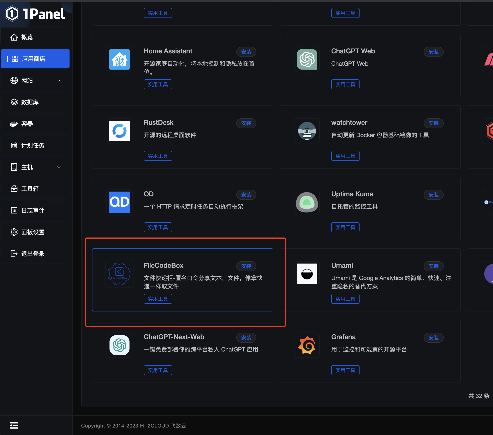

<div align="center">
<h1>文件快递柜-轻量</h1>
<h2>FileCodeBox-Lite</h2>
<p><em>匿名口令分享文本，文件，像拿快递一样取文件</em></p>
<p>交流Q群：739673698</p>
</div>


---

[简体中文](./readme.md) | [English](./readme_en.md)

## 主要特色

- [x] **轻量简洁：** 使用Fastapi + Sqlite3 + Vue2 + ElementUI搭建
- [x] **轻松上传：** 支持复制粘贴和拖拽选择
- [x] **多种类型：** 支持文本和文件
- [x] **防止爆破：** 错误次数限制
- [x] **防止滥用：** IP限制上传次数
- [x] **口令分享：** 随机口令，存取文件，自定义次数及有效期
- [x] **国际化：** 支持中文和英文
- [x] **匿名分享：** 无需注册，无需登录
- [x] **管理面板：** 查看和删除文件
- [x] **一键部署：** 支持Docker一键部署
- [x] **自由拓展：** 支持S3协议和本地文件流，可根据需求在storage文件中新增存储引擎
- [x] **简单明了：** 适合新手练手项目
- [x] **终端下载：** 终端命令`wget https://share.lanol.cn/share/select?code=83432`

## 部署方式

### 1Panel一键部署

进入应用商店 -> 实用工具 -> FileCodeBox

**更新：** 容器 -> 选择 -> 更多 -> 编辑 -> 强制拉取镜像 -> 确认

### 宝塔应用商店一键部署

目前版本为1.6


### Docker一键部署

#### 2.0版本，完善中

默认信息

后端地址：`/#/admin`

后台密码：`FileCodeBox2023`

*支持AMD & ARM*

**一键安装**

```bash
docker run -d --restart=always -p 12345:12345 -v /opt/FileCodeBox/:/app/data --name filecodebox lanol/filecodebox:beta
```

**一键更新**

```bash
docker pull lanol/filecodebox:beta && docker stop filecodebox && docker rm filecodebox && docker run -d --restart=always -p 12345:12345 -v /opt/FileCodeBox/:/app/data --name filecodebox lanol/filecodebox:beta
```

#### 1.6版本AMD

```bash
docker run -d --restart=always -p 12345:12345 -v /opt/FileCodeBox/:/app/data --name filecodebox lanol/filecodebox:latest
```

#### 1.6版本ARM

```bash
docker run -d --restart=always -p 12345:12345 -v /opt/FileCodeBox/:/app/data --name filecodebox lanol/filecodebox:arm
```

### 更新方式

```bash
// 更新容器
docker pull lanol/filecodebox:beta
// 停止和删除容器
docker stop filecodebox && docker rm filecodebox
// 重新运行容器
docker run -d --restart=always -p 12345:12345 -v /opt/FileCodeBox/:/app/data --name filecodebox lanol/filecodebox:latest
```

#### 1.6版本注意事项

本版变动较大，如遇问题可尝试清空/opt/FileCodeBox目录，有问题欢迎反馈。**注意：** 如为首次安装，请查看Docker日志以获取初始密码和后台地址，参考命令如下：

```bash
docker logs filecodebox
```

**后台本地文件列表**：需要将服务器文件移动至/opt/FileCodeBox/data/locals目录，这样才会显示。

## 预览

### 例站

[https://share.lanol.cn](https://share.lanol.cn)

### 截图

<table style="width:100%">
<tr style="width: 100%">
<td style="width: 50%"></td>
<td style="width: 50%"></td>
</tr>
<tr style="width: 100%">
<td style="width: 50%"></td>
<td style="width: 50%"></td>
</tr>
<tr style="width: 100%">
<td style="width: 50%"></td>
<td style="width: 50%"></td>
</tr>
</table>

## 配置文件（适用于1.7及以下版本）

需要修改配置时，将以下内容保存为`.env`文件放置在`/opt/FileCodeBox/`目录下，重启容器即可。
若未使用Docker，则需在项目同目录下创建一个`data`文件夹，并在该文件夹内创建`.env`文件。

```dotenv
# 端口
PORT=12345
# Sqlite数据库文件
DATABASE_URL=sqlite+aiosqlite:///database.db
# 静态文件夹
DATA_ROOT=./static
# 静态文件夹URL
STATIC_URL=/static
# 开启上传
ENABLE_UPLOAD=True
# 错误次数
ERROR_COUNT=5
# 错误限制分钟数
ERROR_MINUTE=10
# 上传次数
UPLOAD_COUNT=60
# 上传限制分钟数
UPLOAD_MINUTE=1
# 删除过期文件的间隔（分钟）
DELETE_EXPIRE_FILES_INTERVAL=10
# 管理地址
ADMIN_ADDRESS=admin
# 管理密码
ADMIN_PASSWORD=admin
# 文件大小限制，默认10MB
FILE_SIZE_LIMIT=10
# 网站标题
TITLE=文件快递柜
# 网站描述
DESCRIPTION=FileCodeBox，文件快递柜，口令传送箱，匿名口令分享文本，文件，图片，视频，音频，压缩包等文件
# 网站关键词
KEYWORDS=FileCodeBox，文件快递柜，口令传送箱，匿名口令分享文本，文件，图片，视频，音频，压缩包等文件
# 存储引擎
STORAGE_ENGINE=filesystem
# 如果使用阿里云OSS服务需额外创建如下参数：
# 阿里云账号AccessKey
KeyId=阿里云账号AccessKey
# 阿里云账号AccessKeySecret
KeySecret=阿里云账号AccessKeySecret
# 阿里云OSS Bucket的地域节点
OSS_ENDPOINT=阿里云OSS Bucket的地域节点
# 阿里云OSS Bucket的BucketName
BUCKET_NAME=阿里云OSS Bucket的BucketName
```

## 项目状态


## Star History

[](https://star-history.com/#vastsa/FileCodeBox&Date)

## 常见问题

1. *413 Request Entity Too Large*:  
   Nginx限制解决方法：
   打开主机的`nginx.conf`配置文件，在`http{}`中加入`client_max_body_size 10m;`，然后重启Nginx。

## 免责声明

本项目开源仅供学习使用，不得用于任何违法用途，否则后果自负，与本人无关。使用请保留项目地址，谢谢。