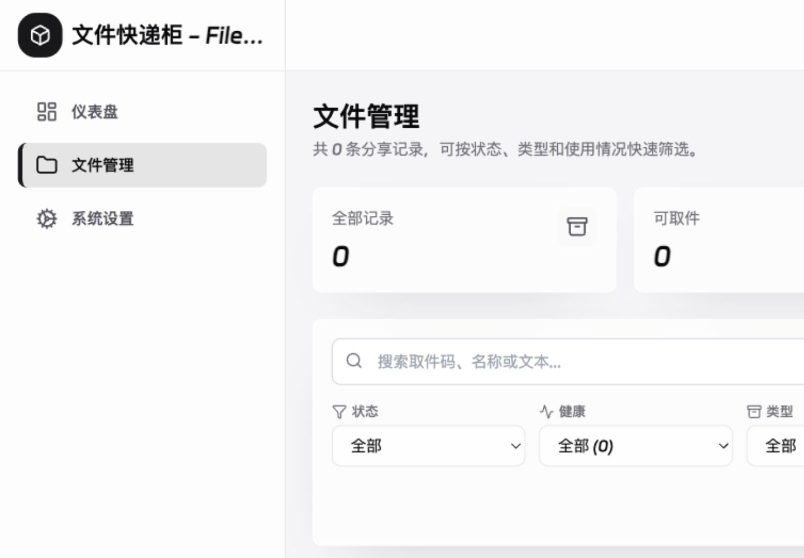
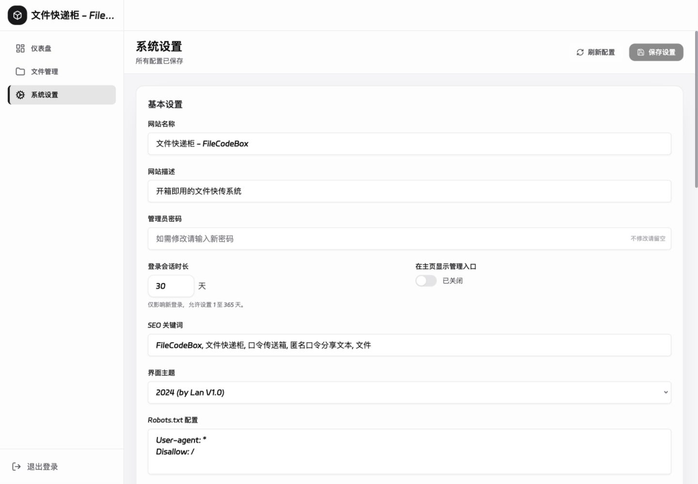
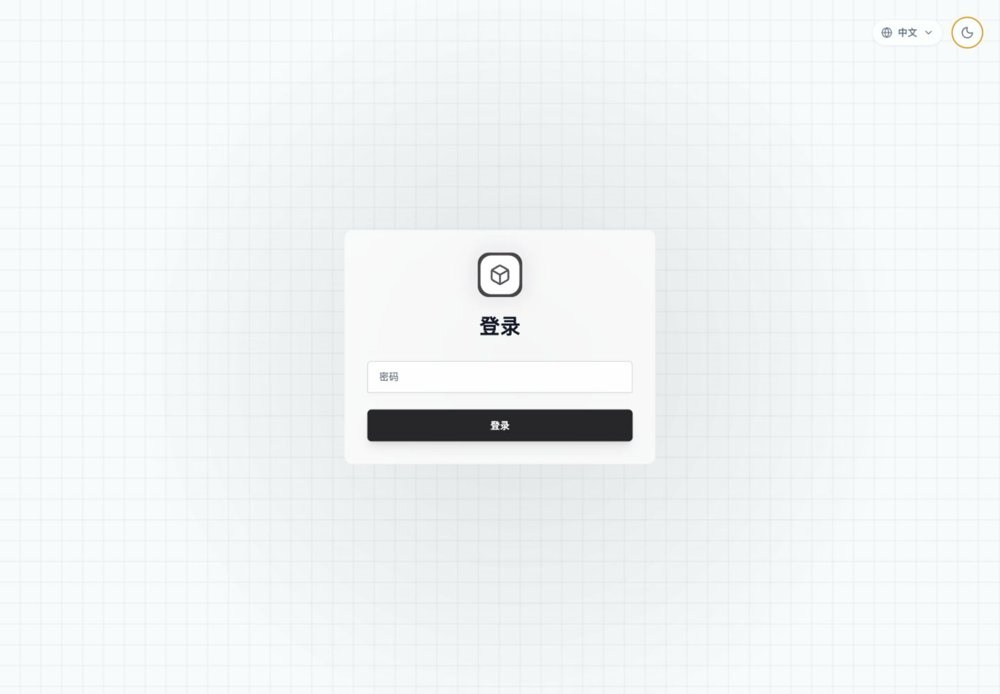

<div align="center">


# FileCodeBox

**开箱即用的自托管文件快递柜**

匿名分享文件与文本。无需注册，输入口令即可取件。

[在线演示](https://share.lanol.cn) · [使用文档](https://fcb-docs.aiuo.net/) · [快速部署](#快速部署) · [English](./readme_en.md)

[](https://github.com/vastsa/FileCodeBox/releases/latest)
[](https://hub.docker.com/r/lanol/filecodebox)
[](./LICENSE)
[](https://github.com/vastsa/FileCodeBox/stargazers)

</div>

```bash
docker run -d --restart unless-stopped -p 12345:12345 -v ./data:/app/data --name filecodebox lanol/filecodebox:2.5.0 # x-release-please-version
```

<div align="center">
  <sub>打开 <code>http://localhost:12345</code>，完成首次初始化，即可开始分享。</sub>
</div>

<br />

<p align="center">
  
</p>

## 为什么选择 FileCodeBox

<table>
<tr>
<td width="33%" valign="top">

### 简单直接

无需账号体系。上传内容后获得取件码，对方输入口令即可下载文件或查看文本。

</td>
<td width="33%" valign="top">

### 自托管优先

一个 Docker 容器即可运行，数据与配置保存在自己的服务器，迁移和备份都足够清晰。

</td>
<td width="33%" valign="top">

### 面向真实使用

支持批量、分片和预签名上传，提供过期策略、容量限制、管理后台与多存储后端。

</td>
</tr>
</table>

## 核心能力

| 分享体验 | 管理与安全 | 存储与部署 |
| --- | --- | --- |
| 文件与文本统一分享 | 首次启动安全初始化 | 本地文件系统 |
| 拖拽、粘贴与批量上传 | 管理员会话与权限控制 | S3 兼容对象存储 |
| 随机或自定义取件码 | 上传频率与错误次数限制 | OneDrive 与 WebDAV |
| 按时间、次数或永久有效 | 文件过期清理与容量配额 | OpenDAL 扩展存储 |
| 分片上传与断点续传 | 文件状态与存储健康视图 | Docker 多架构镜像 |
| 响应式界面与深色模式 | 中英文管理界面 | 反向代理友好 |

## 产品预览

<table>
<tr>
<td width="50%"></td>
<td width="50%"></td>
</tr>
<tr>
<td align="center"><sub>简洁的文件与文本发送流程</sub></td>
<td align="center"><sub>围绕文件健康和存储策略设计的仪表盘</sub></td>
</tr>
</table>

<details>
<summary><b>查看更多界面</b></summary>
<br />
<table>
<tr>
<td></td>
<td></td>
</tr>
<tr>
<td></td>
<td></td>
</tr>
</table>
</details>

<p align="center">
  
  &nbsp;
  
  &nbsp;
  
</p>

> 当前主题源码位于 [FileCodeBoxFronted](https://github.com/vastsa/FileCodeBoxFronted)，镜像构建时会自动拉取其默认分支的最新版本。

## 快速部署

### Docker Compose

```yaml
services:
  filecodebox:
    image: lanol/filecodebox:2.5.0 # x-release-please-version
    container_name: filecodebox
    restart: unless-stopped
    ports:
      - "12345:12345"
    volumes:
      - ./data:/app/data
```

```bash
docker compose up -d
```

生产环境建议固定版本号以便回滚。`latest` 指向最新正式版，`edge-*` 为 `master` 分支开发镜像。

### 手动运行

```bash
git clone https://github.com/vastsa/FileCodeBox.git
cd FileCodeBox
pip install -r requirements.txt
python main.py
```

默认访问地址为 `http://localhost:12345`。首次打开站点时，按引导设置管理员密码。

### 反向代理

<details>
<summary><b>Nginx 示例</b></summary>

```nginx
location / {
    proxy_pass http://127.0.0.1:12345;
    proxy_set_header Host $host;
    proxy_set_header X-Real-IP $remote_addr;
    proxy_set_header X-Forwarded-For $proxy_add_x_forwarded_for;
    proxy_set_header X-Forwarded-Proto $scheme;
    client_max_body_size 100m;
}
```

</details>

## 使用方式

| 操作 | 流程 |
| --- | --- |
| 分享文件 | 选择或拖入文件 → 设置有效期 → 获得取件码 |
| 分享文本 | 输入文本 → 设置有效期 → 获得取件码 |
| 获取内容 | 输入取件码 → 在线查看文本或下载文件 |
| 管理系统 | 访问 `/#/admin` → 查看文件、统计和系统设置 |

命令行同样可以上传：

```bash
curl -X POST "http://localhost:12345/share/file/" \
  -F "file=@/path/to/file.txt" \
  -F "expire_value=1" \
  -F "expire_style=day"
```

完整的接口、分片上传和存储配置，请查看：

- [快速开始](https://fcb-docs.aiuo.net/guide/getting-started)
- [上传与分片](https://fcb-docs.aiuo.net/guide/upload)
- [存储配置](https://fcb-docs.aiuo.net/guide/storage)
- [安全设置](https://fcb-docs.aiuo.net/guide/security)
- [API 文档](https://fcb-docs.aiuo.net/api/)

## 技术架构

```text
Browser / CLI
      │
      ▼
FastAPI · Uvicorn
      │
      ├── SQLite · Tortoise ORM
      ├── Local / S3 / OneDrive / WebDAV / OpenDAL
      └── Vue 3 · Vite frontend
```

| 层级 | 技术 |
| --- | --- |
| API | FastAPI · Pydantic · Uvicorn |
| 数据 | SQLite · Tortoise ORM |
| 异步 I/O | aiofiles · aiohttp · aioboto3 |
| 前端 | Vue 3 · TypeScript · Vite · Tailwind CSS |
| 交付 | Docker · GitHub Actions · VitePress |

## 本地开发

```bash
# 后端
pip install -r requirements.txt
python main.py

# 测试
python -m pytest tests
```

前端在独立仓库 [FileCodeBoxFronted](https://github.com/vastsa/FileCodeBoxFronted)：

```bash
pnpm install
pnpm dev
```

## 常见问题

<details>
<summary><b>如何备份或迁移？</b></summary>

停止服务后备份整个 `data` 目录。它包含数据库、运行配置和本地存储文件。

</details>

<details>
<summary><b>如何调整上传大小？</b></summary>

在管理后台修改上传限制。如果前面还有 Nginx、CDN 或网关，也需要同步调整其请求体限制。

</details>

<details>
<summary><b>支持哪些存储？</b></summary>

内置支持本地、S3、OneDrive、WebDAV 与 OpenDAL。详细参数见[存储配置](https://fcb-docs.aiuo.net/guide/storage)。

</details>

## 参与项目

Issue、功能建议与 Pull Request 都很欢迎。提交代码前请使用清晰的 Conventional Commit：

```text
fix: 修复文件下载问题
feat: 增加新的存储适配器
```

- [提交 Issue](https://github.com/vastsa/FileCodeBox/issues/new/choose)
- [查看贡献指南](https://fcb-docs.aiuo.net/contributing)
- [查看版本记录](https://fcb-docs.aiuo.net/changelog)
- [加入 QQ 群：739673698](https://qm.qq.com/q/PemPzhdEIM)

## 许可证

FileCodeBox 基于 [LGPL-3.0](./LICENSE) 发布。使用本项目时请遵守所在地法律法规，并保留项目地址与版权信息。

<div align="center">

如果 FileCodeBox 对你有帮助，欢迎点亮一个 [Star](https://github.com/vastsa/FileCodeBox/stargazers)。

Made by [vastsa](https://github.com/vastsa)

</div>
