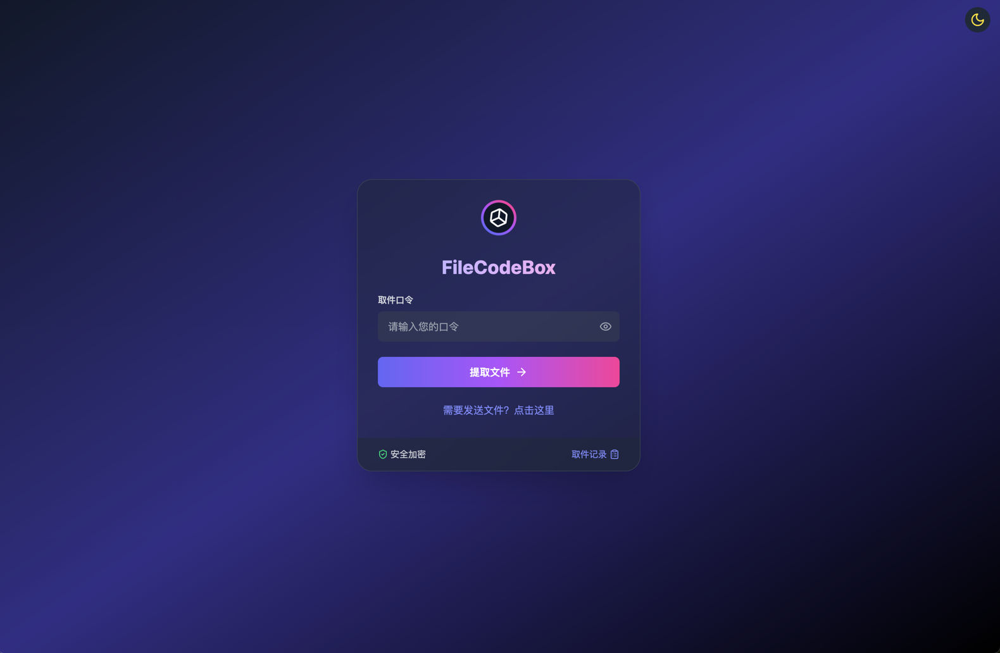
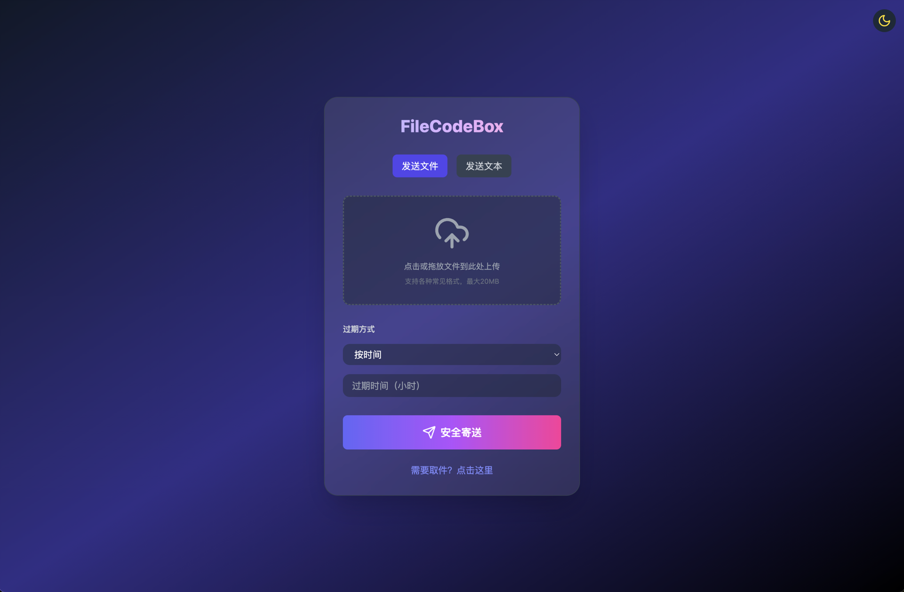
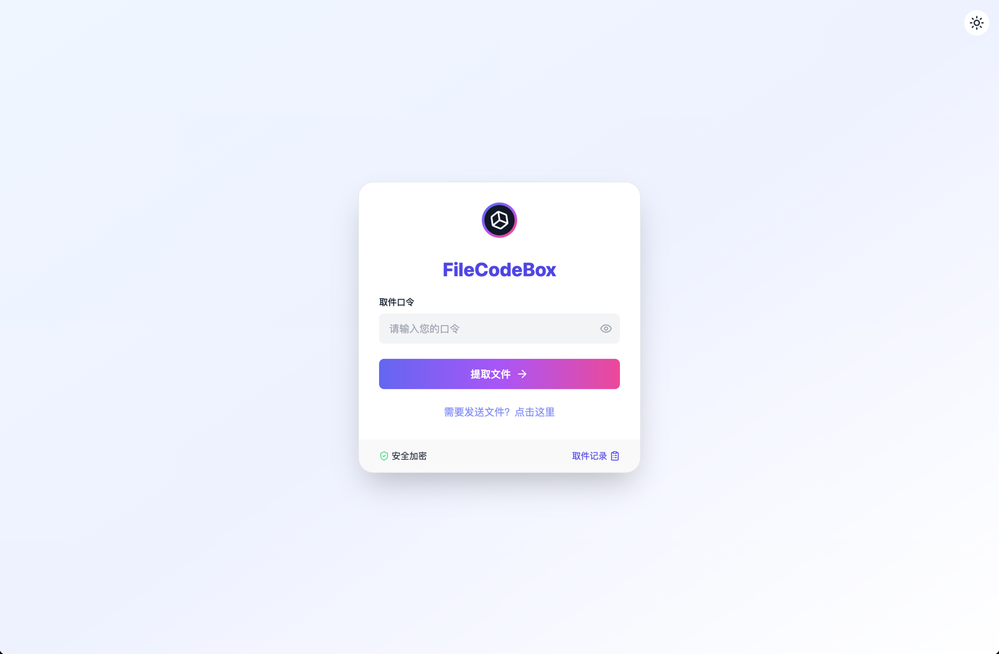
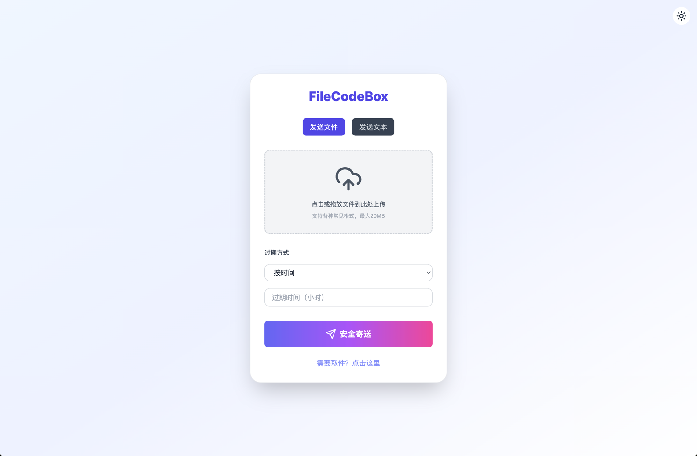
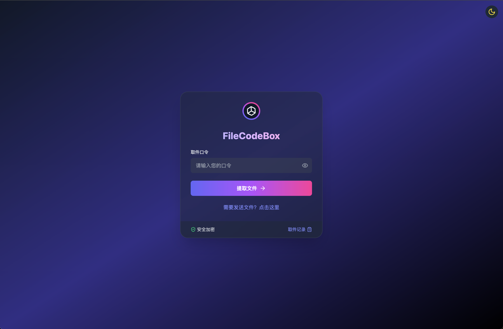
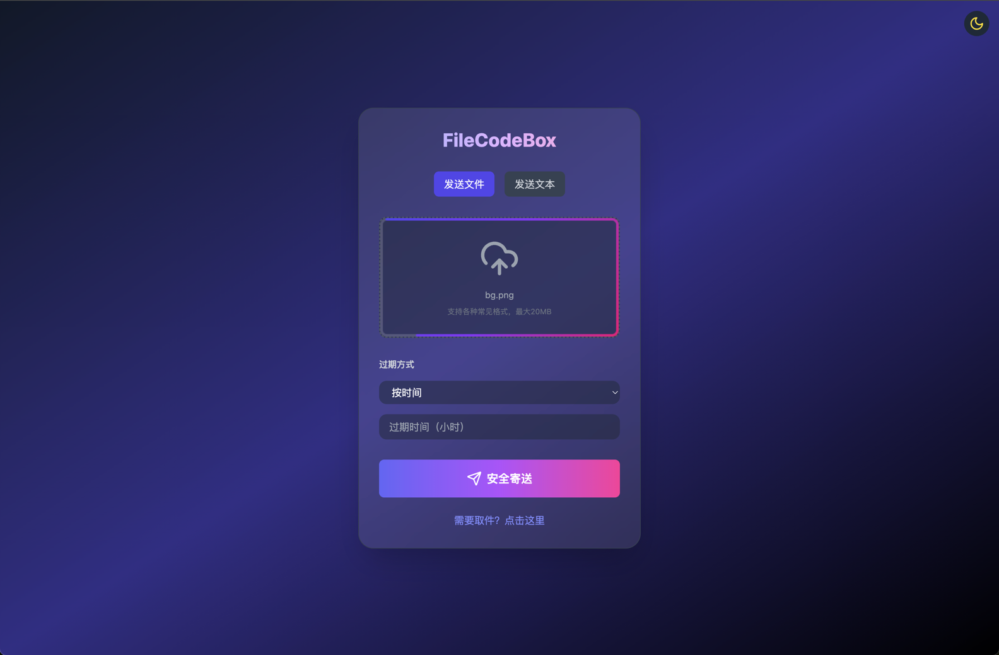
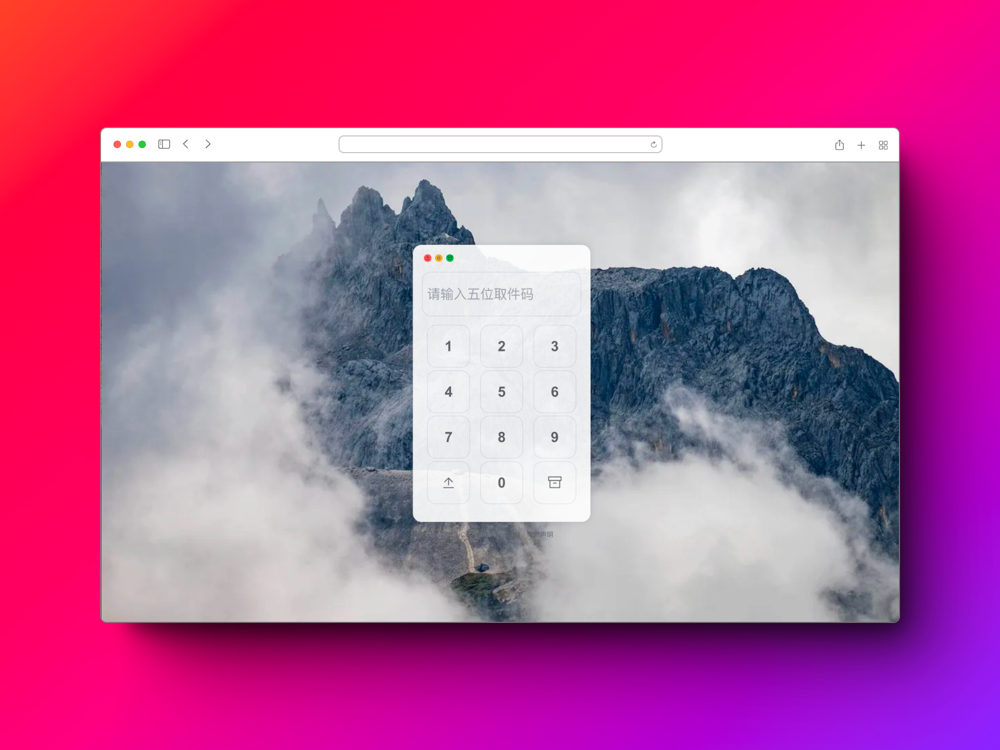
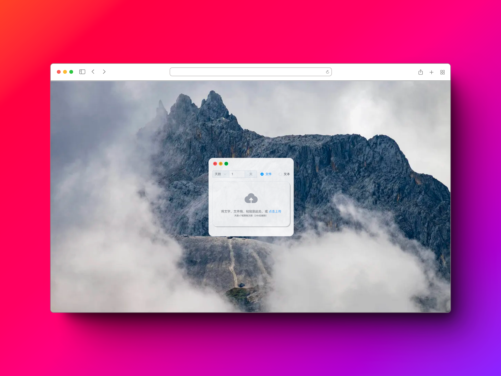
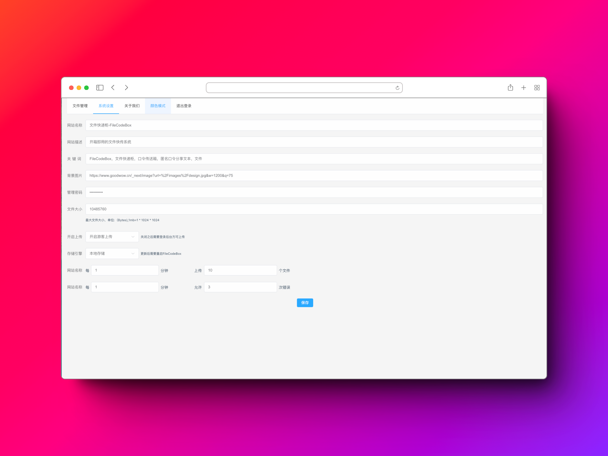

<div align="center">

# FileCodeBox

### 文件快递柜 - 匿名口令分享文本和文件


像拿快递一样取文件，无需注册，输入口令即可获取

[](https://github.com/vastsa/FileCodeBox/stargazers)
[](https://github.com/vastsa/FileCodeBox/network)
[](https://github.com/vastsa/FileCodeBox/issues)
[](https://github.com/vastsa/FileCodeBox/blob/master/LICENSE)
[](https://hub.docker.com/r/lanol/filecodebox)

[](https://www.python.org)
[](https://fastapi.tiangolo.com)
[](https://vuejs.org)

[English](./readme_en.md) | [在线演示](https://share.lanol.cn) | [部署教程](https://github.com/vastsa/FileCodeBox/wiki/部署教程) | [常见问题](https://github.com/vastsa/FileCodeBox/wiki/常见问题) | [QQ群: 739673698](https://qm.qq.com/q/PemPzhdEIM)

```bash
# 🚀 一键部署
docker run -d -p 12345:12345 -v /opt/FileCodeBox:/app/data --name filecodebox lanol/filecodebox:latest
# 国内镜像（如果上面拉取缓慢）: docker.cnb.cool/aixk/filecodebox
```

</div>

---

## 目录

- [项目简介](#-项目简介)
- [功能特性](#-功能特性)
- [界面预览](#-界面预览)
- [快速开始](#-快速开始)
- [使用指南](#-使用指南)
- [开发指南](#-开发指南)
- [常见问题](#-常见问题)
- [贡献指南](#-贡献指南)
- [项目统计](#-项目统计)
- [免责声明](#-免责声明)

---

## 📝 项目简介

FileCodeBox 是一个轻量级的文件分享工具，基于 **FastAPI + Vue3** 开发。用户可以通过简单的方式匿名分享文本和文件，接收者只需输入提取码即可获取内容——就像从快递柜取出快递一样简单。

### 应用场景

| 场景 | 描述 |
|------|------|
| 📁 **临时文件分享** | 快速分享文件，无需注册登录 |
| 📝 **代码片段分享** | 分享代码、配置文件等文本内容 |
| 🕶️ **匿名文件传输** | 保护隐私的点对点传输 |
| 🔄 **跨设备传输** | 在不同设备间快速同步文件 |
| 💾 **临时存储** | 支持自定义过期时间的云存储 |
| 🌐 **私有服务** | 搭建企业或个人专属分享服务 |

---

## ✨ 功能特性

<table>
<tr>
<td width="33%" valign="top">

### 🚀 轻量高效
- FastAPI + SQLite3 后端
- Vue3 + Element Plus 前端
- Docker 一键部署
- 资源占用极低

</td>
<td width="33%" valign="top">

### 🔒 安全可靠
- IP 上传频率限制
- 提取码错误次数限制
- 文件自动过期清理
- 支持管理员认证

</td>
<td width="33%" valign="top">

### 📤 便捷上传
- 拖拽上传
- 复制粘贴上传
- 命令行 curl 上传
- 批量文件上传

</td>
</tr>
<tr>
<td width="33%" valign="top">

### 🎫 灵活分享
- 随机/自定义提取码
- 可设置有效期（时间/次数）
- 支持永久有效
- 文本和文件统一管理

</td>
<td width="33%" valign="top">

### 💾 多存储支持
- 本地文件系统
- S3 兼容存储
- [OneDrive](./docs/guide/storage-onedrive.md)
- [OpenDAL](./docs/guide/storage-opendal.md)

</td>
<td width="33%" valign="top">

### 🌍 国际化
- 简体中文
- 繁体中文
- English
- 响应式设计 / 深色模式

</td>
</tr>
</table>

---

## 🖼️ 界面预览

> 前端源码仓库：[2024主题](https://github.com/vastsa/FileCodeBoxFronted) | [2023主题](https://github.com/vastsa/FileCodeBoxFronted2023)

<details open>
<summary><b>🎨 新版界面 (2024)</b></summary>
<br>
<div align="center">
<table>
<tr>
<td></td>
<td></td>
</tr>
<tr>
<td></td>
<td></td>
</tr>
<tr>
<td></td>
<td></td>
</tr>
</table>
</div>
</details>

<details>
<summary><b>📦 经典界面 (2023)</b></summary>
<br>
<div align="center">
<table>
<tr>
<td></td>
<td></td>
</tr>
<tr>
<td></td>
<td></td>
</tr>
</table>
</div>
</details>

---

## 🚀 快速开始

### Docker 部署（推荐）

生产环境建议使用固定版本标签（例如 `2.4.0`）以便复现和回滚；
`latest` 仅在正式版本发布时更新，`edge-*` 是 master 分支开发镜像。

**方式一：Docker CLI**

```bash
# Docker Hub（推荐）
docker run -d --restart always -p 12345:12345 -v /opt/FileCodeBox:/app/data --name filecodebox lanol/filecodebox:2.5.0 # x-release-please-version

# 国内镜像（如果 Docker Hub 拉取缓慢）
docker run -d --restart always -p 12345:12345 -v /opt/FileCodeBox:/app/data --name filecodebox docker.cnb.cool/aixk/filecodebox
```

**方式二：Docker Compose**

```yaml
services:
  filecodebox:
    image: lanol/filecodebox:2.5.0 # x-release-please-version
    container_name: filecodebox
    restart: unless-stopped
    ports:
      - "12345:12345"
    volumes:
      - ./data:/app/data
    environment:
      - WORKERS=4
      - LOG_LEVEL=info
```

```bash
docker compose up -d
```

**环境变量说明**

| 变量 | 默认值 | 说明 |
|------|--------|------|
| `HOST` | `::` | 监听地址（支持 IPv4/IPv6 双栈） |
| `PORT` | `12345` | 服务端口 |
| `WORKERS` | `4` | 工作进程数（建议设为 CPU 核心数） |
| `LOG_LEVEL` | `info` | 日志级别：`debug` / `info` / `warning` / `error` |

### 反向代理配置

使用 Nginx 时，请添加以下配置以正确获取客户端 IP：

```nginx
location / {
    proxy_pass http://127.0.0.1:12345;
    proxy_set_header Host $host;
    proxy_set_header X-Real-IP $remote_addr;
    proxy_set_header X-Forwarded-For $proxy_add_x_forwarded_for;
    proxy_set_header X-Forwarded-Proto $scheme;
    client_max_body_size 100m;  # 根据需要调整上传大小限制
}
```

### 手动部署

```bash
# 1. 克隆项目
git clone https://github.com/vastsa/FileCodeBox.git
cd FileCodeBox

# 2. 安装依赖
pip install -r requirements.txt

# 3. 启动服务
python main.py
```

---

## 📖 使用指南

### 基础操作

| 操作 | 步骤 |
|------|------|
| **分享文件** | 打开网页 → 选择/拖拽文件 → 设置有效期 → 获取提取码 |
| **获取文件** | 打开网页 → 输入提取码 → 下载文件或查看文本 |
| **管理后台** | 首次访问站点完成初始化 → 访问 `/#/admin` → 输入初始化时设置的密码 |

### 命令行使用（curl）

<details>
<summary><b>点击展开 curl 使用示例</b></summary>

**上传文件**

```bash
# 基础上传（默认 1 天有效期）
curl -X POST "http://localhost:12345/share/file/" \
  -F "file=@/path/to/file.txt"

# 指定 1 小时有效期
curl -X POST "http://localhost:12345/share/file/" \
  -F "file=@/path/to/file.txt" \
  -F "expire_value=1" \
  -F "expire_style=hour"

# 指定下载 10 次后过期
curl -X POST "http://localhost:12345/share/file/" \
  -F "file=@/path/to/file.txt" \
  -F "expire_value=10" \
  -F "expire_style=count"
```

**分享文本**

```bash
curl -X POST "http://localhost:12345/share/text/" \
  -F "text=要分享的文本内容"
```

**下载文件**

```bash
curl -L "http://localhost:12345/share/select/?code=提取码" -o filename
```

**有效期参数**

| `expire_style` | 说明 |
|----------------|------|
| `day` | 天数 |
| `hour` | 小时 |
| `minute` | 分钟 |
| `count` | 下载次数 |
| `forever` | 永久有效 |

**返回示例**

```json
{
  "code": 200,
  "msg": "success",
  "detail": {
    "code": "abcd1234",
    "name": "file.txt"
  }
}
```

**需要认证时**（管理员关闭游客上传后）

```bash
# 1. 获取 token
curl -X POST "http://localhost:12345/admin/login" \
  -H "Content-Type: application/json" \
  -d '{"password": "<初始化时设置的管理员密码>"}'

# 2. 携带 token 上传
curl -X POST "http://localhost:12345/share/file/" \
  -H "Authorization: Bearer <token>" \
  -F "file=@/path/to/file.txt"
```

</details>

---

## 🛠 开发指南

### 项目结构

```
FileCodeBox/
├── apps/              # 应用模块
│   ├── admin/         # 管理后台
│   └── base/          # 基础功能
├── core/              # 核心模块
├── data/              # 数据目录（运行时生成）
├── docs/              # 文档
└── main.py            # 入口文件
```

### 本地开发

**后端**

```bash
pip install -r requirements.txt
python main.py
```

**前端**

```bash
# 前端仓库: https://github.com/vastsa/FileCodeBoxFronted
cd fcb-fronted
npm install
npm run dev
```

### 技术栈

| 类别 | 技术 |
|------|------|
| **后端框架** | FastAPI 0.128+ / Uvicorn |
| **数据库** | SQLite + Tortoise ORM |
| **数据验证** | Pydantic 2.x |
| **异步支持** | aiofiles / aiohttp / aioboto3 |
| **对象存储** | S3 协议 / OneDrive / OpenDAL |
| **前端框架** | Vue 3 + Element Plus + Vite |
| **运行环境** | Python 3.8+ / Node.js 18+ |
| **容器化** | Docker / Docker Compose |

---

## ❓ 常见问题

<details>
<summary><b>如何修改上传大小限制？</b></summary>

在管理面板中修改 `uploadSize` 配置项。如果使用 Nginx 反向代理，还需修改 `client_max_body_size`。
</details>

<details>
<summary><b>如何配置存储引擎？</b></summary>

在管理面板中选择存储引擎类型并配置相应参数。支持本地存储、S3、OneDrive、OpenDAL 等。
</details>

<details>
<summary><b>如何备份数据？</b></summary>

备份 `data` 目录即可，包含数据库和上传的文件。
</details>

<details>
<summary><b>如何修改管理员密码？</b></summary>

登录管理面板后，在系统设置中修改 `adminPassword` 配置项。
</details>

更多问题请访问 [Wiki](https://github.com/vastsa/FileCodeBox/wiki/常见问题) 或加入 [QQ群: 739673698](https://qm.qq.com/q/PemPzhdEIM)

---

## 🤝 贡献指南

欢迎提交 Issue 和 Pull Request！

```bash
# 1. Fork 并克隆
git clone https://github.com/your-username/FileCodeBox.git

# 2. 创建分支
git checkout -b feature/your-feature

# 3. 提交更改
git commit -m "feat: add your feature"

# 4. 推送并创建 PR
git push origin feature/your-feature
```

---

## 📊 项目统计

<div align="center">

<a href="https://hellogithub.com/repository/75ad7ffedd404a6485b4d621ec5b47e6" target="_blank">
  
</a>


[](https://star-history.com/#vastsa/FileCodeBox&Date)

</div>

---

## 🗓 更新计划

- [ ] 2025 年新皮肤
- [ ] 文件收集功能

---

## 📜 免责声明

本项目开源仅供学习交流使用，不得用于任何违法用途，否则后果自负，与作者无关。使用本项目时请保留项目地址和版权信息。

---

<div align="center">

**如果觉得项目不错，欢迎 ⭐ Star 支持！**

Made with ❤️ by [vastsa](https://github.com/vastsa)


</div>
