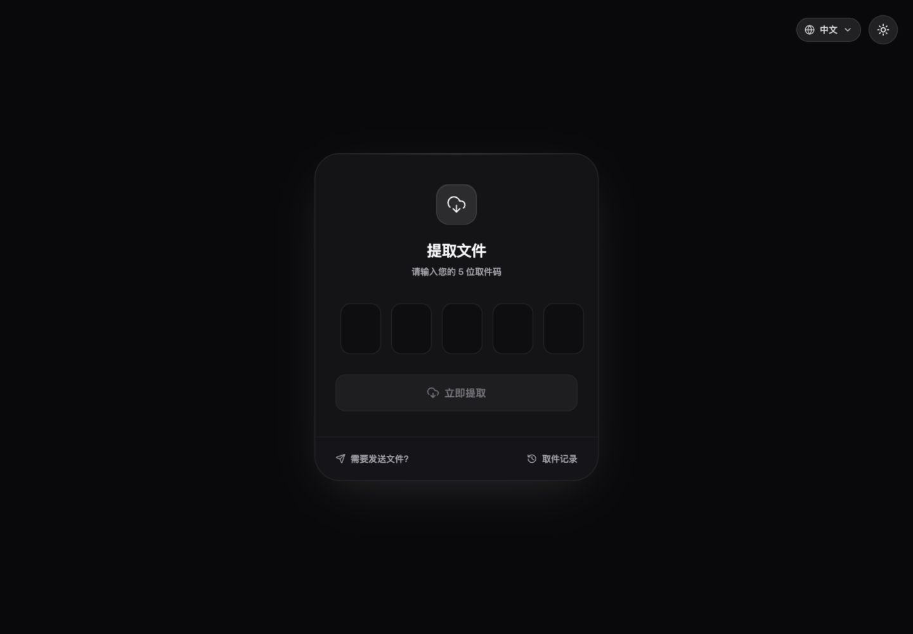
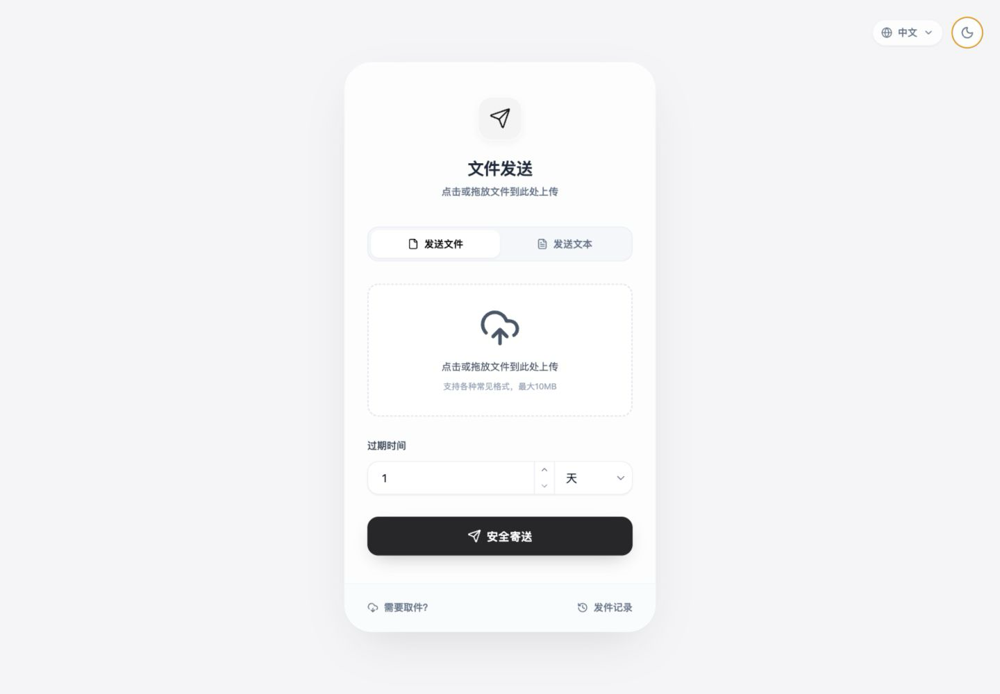
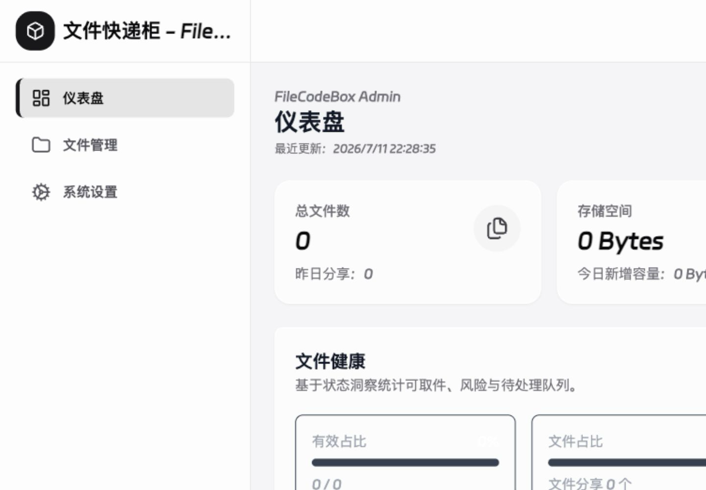
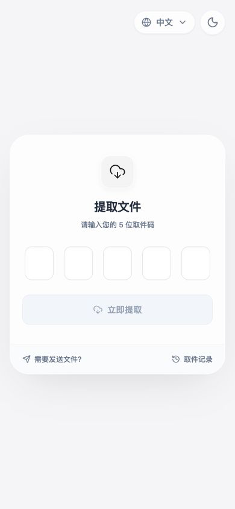
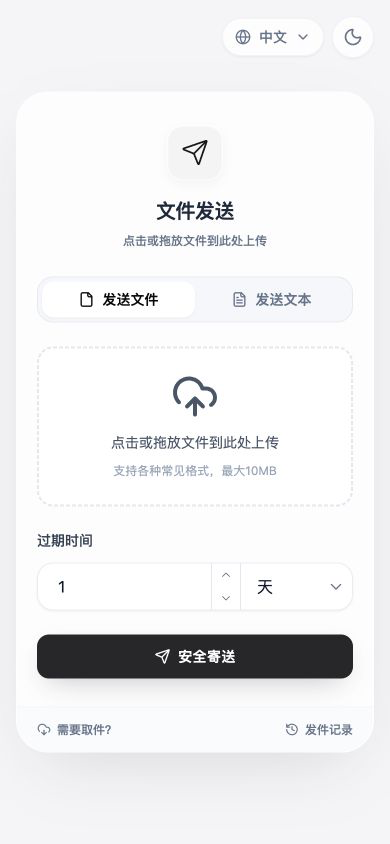
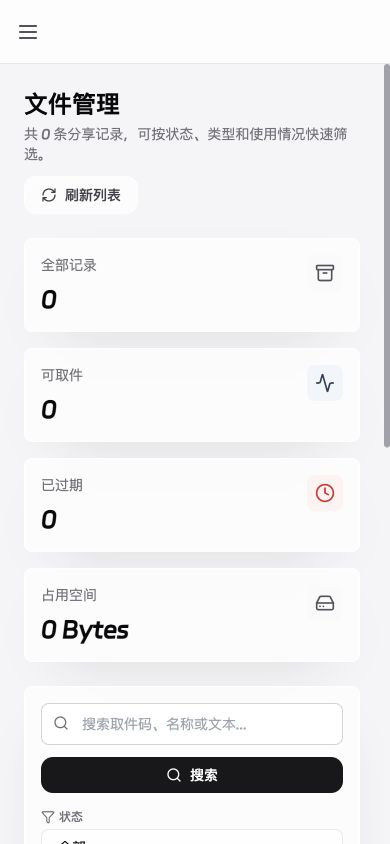

<div align="center">


# FileCodeBox

### Share files like picking up a package

A lightweight, modern, self-hosted file sharing service. No account required—upload, share the passcode, and retrieve.

[Live Demo](https://share.lanol.cn)　·　[Documentation](https://fcb-docs.aiuo.net/en/)　·　[简体中文](./readme.md)

[](https://github.com/vastsa/FileCodeBox/releases/latest)
[](https://hub.docker.com/r/lanol/filecodebox)
[](https://github.com/vastsa/FileCodeBox/stargazers)
[](./LICENSE)

<br />



</div>

## Start with one command

```bash
docker run -d --restart unless-stopped -p 12345:12345 -v ./data:/app/data --name filecodebox lanol/filecodebox:2.5.0 # x-release-please-version
```

Open `http://localhost:12345` and complete first-run setup. Pin a version in production; `latest` tracks the newest stable release.

## Simple, yet capable

<table>
<tr>
<td width="33%" valign="top"><b>Share instantly</b><br /><sub>Files and text in one flow, with drag, paste, batch, and chunked uploads.</sub></td>
<td width="33%" valign="top"><b>Expire on your terms</b><br /><sub>Expire by time or retrieval count, keep forever, and clean up automatically.</sub></td>
<td width="33%" valign="top"><b>Own your data</b><br /><sub>Local, S3, OneDrive, WebDAV, and OpenDAL storage on infrastructure you control.</sub></td>
</tr>
</table>

## From sharing to administration

<table>
<tr>
<td width="50%"></td>
<td width="50%"></td>
</tr>
</table>

<p align="center">
  
  &nbsp;&nbsp;
  
  &nbsp;&nbsp;
  
</p>

<div align="center">

`FastAPI`　`Vue 3`　`SQLite`　`Docker`　`S3`　`WebDAV`　`Dark Mode`

</div>

## Learn more

- [Getting started](https://fcb-docs.aiuo.net/en/guide/getting-started) · deployment, setup, and upgrades
- [Storage](https://fcb-docs.aiuo.net/en/guide/storage) · local and object storage
- [Security](https://fcb-docs.aiuo.net/en/guide/security) · rate limits, sessions, and access protection
- [API reference](https://fcb-docs.aiuo.net/en/api/) · upload, retrieval, and administration
- [Frontend source](https://github.com/vastsa/FileCodeBoxFronted) · the active 2024 theme

## Contributing

[Issues](https://github.com/vastsa/FileCodeBox/issues/new/choose) and pull requests are welcome. FileCodeBox is released under [LGPL-3.0](./LICENSE).

<div align="center">

**If FileCodeBox helps you, consider leaving a Star.**

</div>
